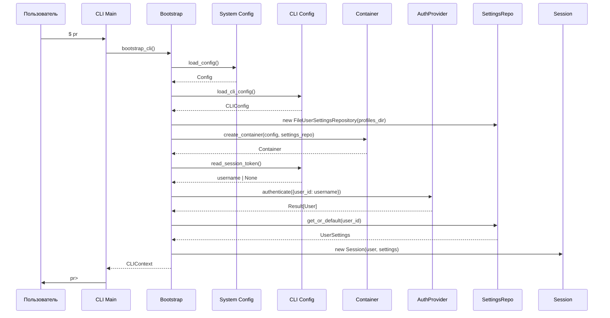

# Этап 1.6.2: CLI Context & Bootstrap

## 1. Цель

Реализовать механизм инициализации CLI:
- Загрузка конфигурации из файлов
- Определение текущего пользователя (сессия)
- Формирование контекста для выполнения команд
- Адаптер для хранения настроек в YAML-файлах

**Принцип:** CLI-специфичные компоненты живут в `clients/cli/`, общие — в `adapters/`.

---

## 2. Архитектура

### 2.1. Слои конфигурации

```
┌─────────────────────────────────────────────────────────────────┐
│                    Уровень 1: System Config                      │
│                    (di/config.py — уже есть)                     │
│                                                                  │
│  Config                                                          │
│  ├── app: AppConfig (name, environment, default_locale)          │
│  ├── storage: StorageConfig (type, json/sqlite/pg paths)         │
│  ├── executor: ExecutorConfig (type, timeout, memory)            │
│  └── auth: AuthConfig (type: anonymous/telegram/token)           │
│                                                                  │
│  Загружается из: practiceraptor/config/config.yaml               │
│  Используется: всеми интерфейсами                                │
└─────────────────────────────────────────────────────────────────┘
                              │
                              ▼
┌─────────────────────────────────────────────────────────────────┐
│                    Уровень 2: CLI Config                         │
│                    (clients/cli/config.py — НОВЫЙ)               │
│                                                                  │
│  CLIConfig                                                       │
│  ├── editor: str = "vim"                                         │
│  ├── editor_args: tuple[str, ...] = ()                           │
│  ├── theme: str = "default"                                      │
│  ├── auto_save_drafts: bool = True                               │
│  ├── profiles_dir: Path                                          │
│  └── session_file: Path                                          │
│                                                                  │
│  Загружается из: ~/.practiceraptor.yaml                          │
│  Используется: только CLI                                        │
└─────────────────────────────────────────────────────────────────┘
                              │
                              ▼
┌─────────────────────────────────────────────────────────────────┐
│                    Уровень 3: User Settings                      │
│                    (core/domain/models.py — из 1.6.1)            │
│                                                                  │
│  UserSettings                                                    │
│  ├── default_language: Language                                  │
│  ├── locale: str                                                 │
│  ├── default_filters: TaskFilters                                │
│  └── problems_per_page: int                                      │
│                                                                  │
│  Загружается из: ~/.config/practiceraptor/profiles/{user}.yaml   │
│  Используется: всеми интерфейсами (через IUserSettingsRepository)│
└─────────────────────────────────────────────────────────────────┘
```

### 2.2. Runtime-объекты

```
┌─────────────────────────────────────────────────────────────────┐
│                         CLIContext                               │
│              (единая точка доступа для команд)                   │
├─────────────────────────────────────────────────────────────────┤
│                                                                  │
│  ┌─────────────────┐                                             │
│  │    Container    │  Core-зависимости (repos, executor, auth)   │
│  └─────────────────┘                                             │
│                                                                  │
│  ┌─────────────────┐                                             │
│  │    Session      │  Текущий пользователь + настройки           │
│  │  ├── user       │                                             │
│  │  ├── settings   │                                             │
│  │  └── state      │  (current_problem, current_draft)           │
│  └─────────────────┘                                             │
│                                                                  │
│  ┌─────────────────┐                                             │
│  │   CLIConfig     │  CLI-специфичные настройки                  │
│  └─────────────────┘                                             │
│                                                                  │
└─────────────────────────────────────────────────────────────────┘
```

---

## 3. Новые компоненты

### 3.1. CLIConfig

**Файл:** `clients/cli/config.py`

```python
"""CLI-specific configuration."""
from dataclasses import dataclass, field
from pathlib import Path
from typing import Any

import yaml


@dataclass(frozen=True)
class CLIConfig:
    """
    Configuration specific to CLI interface.

    These settings are NOT part of Core domain because:
    - Telegram doesn't need 'editor'
    - Web doesn't need 'theme' (has CSS)
    - Only CLI uses these

    Loaded from: ~/.practiceraptor.yaml
    """
    # Editor settings
    editor: str = "vim"
    editor_args: tuple[str, ...] = ()

    # Display settings
    theme: str = "default"  # default, dark, light, minimal

    # Behavior
    auto_save_drafts: bool = True
    show_hints_on_wrong_answer: bool = True

    # Paths (relative to home or absolute)
    config_dir: Path = field(
        default_factory=lambda: Path.home() / ".config" / "practiceraptor"
    )
    data_dir: Path = field(
        default_factory=lambda: Path.home() / ".config" / "practiceraptor" / "data"
    )

    # Session management
    session_file: str = "session.token"
    default_username: str = "_default"

    @property
    def profiles_dir(self) -> Path:
        """Directory containing user profiles."""
        return self.config_dir / "profiles"

    @property
    def session_path(self) -> Path:
        """Full path to session token file."""
        return self.config_dir / self.session_file

    def get_profile_path(self, username: str) -> Path:
        """Get path to user's profile file."""
        return self.profiles_dir / f"{username}.yaml"


def load_cli_config(config_path: Path | None = None) -> CLIConfig:
    """
    Load CLI configuration from YAML file.

    Args:
        config_path: Path to config file. If None, uses ~/.practiceraptor.yaml

    Returns:
        CLIConfig with loaded or default values.
    """
    if config_path is None:
        config_path = Path.home() / ".practiceraptor.yaml"

    if not config_path.exists():
        return CLIConfig()

    with open(config_path, "r", encoding="utf-8") as f:
        data = yaml.safe_load(f) or {}

    return _parse_cli_config(data)


def _parse_cli_config(data: dict[str, Any]) -> CLIConfig:
    """Parse CLI config from dictionary."""
    cli_data = data.get("cli", {})

    editor_args = cli_data.get("editor_args", [])
    if isinstance(editor_args, str):
        editor_args = [editor_args]

    config_dir = cli_data.get("config_dir")
    if config_dir:
        config_dir = Path(config_dir).expanduser()
    else:
        config_dir = Path.home() / ".config" / "practiceraptor"

    data_dir = cli_data.get("data_dir")
    if data_dir:
        data_dir = Path(data_dir).expanduser()
    else:
        data_dir = config_dir / "data"

    return CLIConfig(
        editor=cli_data.get("editor", "vim"),
        editor_args=tuple(editor_args),
        theme=cli_data.get("theme", "default"),
        auto_save_drafts=cli_data.get("auto_save_drafts", True),
        show_hints_on_wrong_answer=cli_data.get("show_hints_on_wrong_answer", True),
        config_dir=config_dir,
        data_dir=data_dir,
        session_file=data.get("session_token_file", "session.token"),
        default_username=data.get("default_username", "_default"),
    )


def save_cli_config(config: CLIConfig, config_path: Path | None = None) -> None:
    """Save CLI configuration to YAML file."""
    if config_path is None:
        config_path = Path.home() / ".practiceraptor.yaml"

    data = {
        "cli": {
            "editor": config.editor,
            "editor_args": list(config.editor_args),
            "theme": config.theme,
            "auto_save_drafts": config.auto_save_drafts,
            "show_hints_on_wrong_answer": config.show_hints_on_wrong_answer,
            "config_dir": str(config.config_dir),
            "data_dir": str(config.data_dir),
        },
        "session_token_file": config.session_file,
        "default_username": config.default_username,
    }

    config_path.parent.mkdir(parents=True, exist_ok=True)
    with open(config_path, "w", encoding="utf-8") as f:
        yaml.safe_dump(data, f, default_flow_style=False, allow_unicode=True)
```

---

### 3.2. SessionState

**Файл:** `clients/cli/session.py`

```python
"""CLI session management."""
from dataclasses import dataclass, field
from datetime import datetime
from pathlib import Path

from core.domain.models import User, UserSettings, Draft
from core.domain.enums import Language


@dataclass(frozen=True)
class SessionState:
    """
    Mutable state within a session.

    Tracks what the user is currently working on.
    This is runtime state, not persisted.
    """
    current_problem_id: int | None = None
    current_language: Language | None = None
    current_draft: Draft | None = None

    def with_problem(self, problem_id: int, language: Language) -> "SessionState":
        """Create new state with selected problem."""
        return SessionState(
            current_problem_id=problem_id,
            current_language=language,
            current_draft=self.current_draft,
        )

    def with_draft(self, draft: Draft) -> "SessionState":
        """Create new state with draft."""
        return SessionState(
            current_problem_id=draft.problem_id,
            current_language=draft.language,
            current_draft=draft,
        )

    def clear(self) -> "SessionState":
        """Create empty state."""
        return SessionState()


@dataclass(frozen=True)
class Session:
    """
    Current user session.

    Combines:
    - User identity (from auth)
    - User settings (from settings repo)
    - Runtime state (current problem, draft)
    """
    user: User
    settings: UserSettings
    state: SessionState = field(default_factory=SessionState)
    started_at: datetime = field(default_factory=datetime.now)

    @property
    def user_id(self) -> str:
        """Convenience accessor for user ID."""
        return self.user.id

    @property
    def locale(self) -> str:
        """Get effective locale."""
        return self.settings.locale

    @property
    def default_language(self) -> Language:
        """Get effective default language."""
        return self.settings.default_language

    def with_settings(self, settings: UserSettings) -> "Session":
        """Create new session with updated settings."""
        return Session(
            user=self.user,
            settings=settings,
            state=self.state,
            started_at=self.started_at,
        )

    def with_state(self, state: SessionState) -> "Session":
        """Create new session with updated state."""
        return Session(
            user=self.user,
            settings=self.settings,
            state=state,
            started_at=self.started_at,
        )


def read_session_token(session_path: Path) -> str | None:
    """
    Read current username from session file.

    Returns None if file doesn't exist or is empty.
    """
    if not session_path.exists():
        return None

    content = session_path.read_text(encoding="utf-8").strip()
    return content if content else None


def write_session_token(session_path: Path, username: str) -> None:
    """Write username to session file."""
    session_path.parent.mkdir(parents=True, exist_ok=True)
    session_path.write_text(username, encoding="utf-8")


def clear_session_token(session_path: Path) -> None:
    """Remove session file (logout)."""
    if session_path.exists():
        session_path.unlink()
```

---

### 3.3. CLIContext

**Файл:** `clients/cli/context.py`

```python
"""CLI execution context."""
from dataclasses import dataclass

from di.container import Container
from clients.cli.config import CLIConfig
from clients.cli.session import Session


@dataclass(frozen=True)
class CLIContext:
    """
    Complete context for CLI command execution.

    This is the single object passed to all CLI commands,
    providing access to:
    - Core dependencies (via container)
    - Current session (user, settings, state)
    - CLI configuration (editor, theme)

    Immutable - commands create new context via with_* methods.
    """
    container: Container
    session: Session
    cli_config: CLIConfig

    # Convenience accessors
    @property
    def user_id(self) -> str:
        return self.session.user_id

    @property
    def locale(self) -> str:
        return self.session.locale

    @property
    def problem_repo(self):
        return self.container.problem_repo

    @property
    def progress_repo(self):
        return self.container.progress_repo

    @property
    def draft_repo(self):
        return self.container.draft_repo

    @property
    def settings_repo(self):
        return self.container.settings_repo

    @property
    def executor(self):
        return self.container.executor

    def with_session(self, session: Session) -> "CLIContext":
        """Create new context with updated session."""
        return CLIContext(
            container=self.container,
            session=session,
            cli_config=self.cli_config,
        )
```

---

### 3.4. FileUserSettingsRepository (Adapter)

**Файл:** `adapters/storage/file_user_settings_repository.py`

```python
"""YAML file-based user settings repository."""
from dataclasses import asdict
from datetime import datetime
from pathlib import Path
from typing import Any

import yaml

from core.domain.models import UserSettings, TaskFilters
from core.domain.enums import Language, Difficulty, ProgressStatus
from core.domain.result import Ok, Err, Result
from core.domain.errors import NotFoundError, StorageError
from core.domain.factories import create_default_settings
from core.ports.repositories import IUserSettingsRepository


class FileUserSettingsRepository:
    """
    User settings repository using YAML files.

    Each user has a separate file: {profiles_dir}/{user_id}.yaml

    Used in CLI mode where settings are stored locally.
    """

    def __init__(self, profiles_dir: Path):
        """
        Initialize repository.

        Args:
            profiles_dir: Directory containing profile YAML files
        """
        self._profiles_dir = profiles_dir
        self._profiles_dir.mkdir(parents=True, exist_ok=True)

    def _get_path(self, user_id: str) -> Path:
        """Get path to user's settings file."""
        # Sanitize user_id for filesystem
        safe_id = "".join(c if c.isalnum() or c in "_-" else "_" for c in user_id)
        return self._profiles_dir / f"{safe_id}.yaml"

    def get(self, user_id: str) -> Result[UserSettings, NotFoundError]:
        """Get settings for user."""
        path = self._get_path(user_id)

        if not path.exists():
            return Err(NotFoundError(entity="UserSettings", id=user_id))

        try:
            with open(path, "r", encoding="utf-8") as f:
                data = yaml.safe_load(f) or {}

            settings = self._parse_settings(user_id, data)
            return Ok(settings)

        except Exception as e:
            return Err(NotFoundError(
                entity="UserSettings",
                id=user_id,
                message=f"Failed to load settings: {e}",
            ))

    def get_or_default(self, user_id: str) -> UserSettings:
        """Get settings for user, creating defaults if not found."""
        result = self.get(user_id)
        match result:
            case Ok(settings):
                return settings
            case Err(_):
                return create_default_settings(user_id)

    def save(self, settings: UserSettings) -> Result[UserSettings, StorageError]:
        """Save settings (create or update)."""
        path = self._get_path(settings.user_id)

        try:
            data = self._serialize_settings(settings)

            path.parent.mkdir(parents=True, exist_ok=True)
            with open(path, "w", encoding="utf-8") as f:
                yaml.safe_dump(data, f, default_flow_style=False, allow_unicode=True)

            return Ok(settings)

        except Exception as e:
            return Err(StorageError(
                operation="save",
                entity="UserSettings",
                message=str(e),
            ))

    def delete(self, user_id: str) -> Result[None, NotFoundError]:
        """Delete settings for user."""
        path = self._get_path(user_id)

        if not path.exists():
            return Err(NotFoundError(entity="UserSettings", id=user_id))

        try:
            path.unlink()
            return Ok(None)
        except Exception as e:
            return Err(NotFoundError(
                entity="UserSettings",
                id=user_id,
                message=f"Failed to delete: {e}",
            ))

    def _parse_settings(self, user_id: str, data: dict[str, Any]) -> UserSettings:
        """Parse settings from dictionary."""
        user_defaults = data.get("user_defaults", {})
        filters_data = user_defaults.get("task_filters", {})

        # Parse difficulty
        difficulty_str = filters_data.get("difficulty")
        difficulty = None
        if difficulty_str and difficulty_str != "all":
            try:
                difficulty = Difficulty(difficulty_str)
            except ValueError:
                pass

        # Parse status
        status_str = filters_data.get("status")
        status = None
        if status_str and status_str != "all":
            try:
                status = ProgressStatus(status_str)
            except ValueError:
                pass

        # Parse language
        lang_str = user_defaults.get("default_language", "python3")
        try:
            language = Language(lang_str)
        except ValueError:
            language = Language.PYTHON

        filters = TaskFilters(
            difficulty=difficulty,
            tags=tuple(filters_data.get("tags", [])),
            status=status,
        )

        return UserSettings(
            user_id=user_id,
            default_language=language,
            locale=user_defaults.get("interface_language", "en"),
            default_filters=filters,
            problems_per_page=user_defaults.get("problems_per_page", 20),
        )

    def _serialize_settings(self, settings: UserSettings) -> dict[str, Any]:
        """Serialize settings to dictionary."""
        filters = settings.default_filters

        return {
            "user_defaults": {
                "default_language": settings.default_language.value,
                "interface_language": settings.locale,
                "problems_per_page": settings.problems_per_page,
                "task_filters": {
                    "difficulty": filters.difficulty.value if filters.difficulty else "all",
                    "tags": list(filters.tags),
                    "status": filters.status.value if filters.status else "all",
                },
            },
        }
```

---

### 3.5. Bootstrap (Цепочка инициализации)

**Файл:** `clients/cli/bootstrap.py`

```python
"""CLI application bootstrap."""
from pathlib import Path

from di.config import load_config, Config
from di.container import Container
from di.providers import create_container

from clients.cli.config import load_cli_config, CLIConfig
from clients.cli.session import Session, SessionState, read_session_token
from clients.cli.context import CLIContext

from adapters.storage.file_user_settings_repository import FileUserSettingsRepository

from core.domain.result import Ok, Err


def bootstrap_cli(
    system_config_path: Path | None = None,
    cli_config_path: Path | None = None,
) -> CLIContext:
    """
    Initialize CLI application and create execution context.

    Bootstrap sequence:
    1. Load system config (storage, executor, auth type)
    2. Create Core container (repos, executor, auth provider)
    3. Load CLI config (editor, theme, paths)
    4. Determine current user from session token
    5. Load user settings
    6. Create Session and CLIContext

    Args:
        system_config_path: Path to system config. None for default.
        cli_config_path: Path to CLI config. None for ~/.practiceraptor.yaml

    Returns:
        Fully initialized CLIContext
    """
    # Step 1: Load system configuration
    system_config = load_config(system_config_path)

    # Step 2: Create core container (with placeholder for settings_repo)
    # We need CLIConfig first to know where profiles are stored
    cli_config = load_cli_config(cli_config_path)

    # Step 3: Create settings repository using CLI config paths
    settings_repo = FileUserSettingsRepository(cli_config.profiles_dir)

    # Step 4: Create container with settings_repo
    container = _create_container_with_settings(system_config, settings_repo)

    # Step 5: Determine current user
    session_username = read_session_token(cli_config.session_path)
    username = session_username or cli_config.default_username

    # Step 6: Get or create user via auth provider
    auth_result = container.auth.authenticate({"user_id": username})
    match auth_result:
        case Ok(user):
            pass
        case Err(error):
            # This shouldn't happen with anonymous auth, but handle gracefully
            raise RuntimeError(f"Authentication failed: {error}")

    # Step 7: Load user settings
    settings = settings_repo.get_or_default(user.id)

    # Step 8: Create session
    session = Session(
        user=user,
        settings=settings,
        state=SessionState(),
    )

    # Step 9: Create context
    return CLIContext(
        container=container,
        session=session,
        cli_config=cli_config,
    )


def _create_container_with_settings(
    config: Config,
    settings_repo: FileUserSettingsRepository,
) -> Container:
    """
    Create container with injected settings repository.

    This is a modified version of create_container that accepts
    a pre-created settings_repo (since it depends on CLI paths).
    """
    from di.providers import (
        _create_problem_repo,
        _create_user_repo,
        _create_draft_repo,
        _create_submission_repo,
        _create_progress_repo,
        _create_executor,
        _create_auth,
    )

    return Container(
        problem_repo=_create_problem_repo(config.storage),
        user_repo=_create_user_repo(config.storage),
        draft_repo=_create_draft_repo(config.storage),
        submission_repo=_create_submission_repo(config.storage),
        progress_repo=_create_progress_repo(config.storage),
        executor=_create_executor(config.executor),
        auth=_create_auth(config.auth),
        settings_repo=settings_repo,
        default_locale=config.app.default_locale,
        default_timeout_sec=config.executor.timeout_sec,
    )
```

---

## 4. Диаграмма инициализации



---

## 5. Файловая структура после изменений

```
practiceraptor/
├── core/
│   ├── domain/
│   │   ├── models.py           # + TaskFilters, UserSettings, ProblemListItem
│   │   └── factories.py        # + create_default_settings
│   ├── ports/
│   │   └── repositories.py     # + IUserSettingsRepository
│   └── services/
│       └── settings.py         # НОВЫЙ
│
├── adapters/
│   └── storage/
│       └── file_user_settings_repository.py  # НОВЫЙ
│
├── clients/
│   └── cli/
│       ├── config.py           # НОВЫЙ: CLIConfig
│       ├── session.py          # НОВЫЙ: Session, SessionState
│       ├── context.py          # НОВЫЙ: CLIContext
│       ├── bootstrap.py        # НОВЫЙ: bootstrap_cli()
│       └── main.py             # Обновить: использовать bootstrap
│
└── di/
    └── container.py            # + settings_repo
```

---

## 6. Тесты

### 6.1. Unit-тесты для CLIConfig

```python
def test_load_cli_config_returns_defaults_when_file_missing():
    config = load_cli_config(Path("/nonexistent/config.yaml"))
    assert config.editor == "vim"
    assert config.theme == "default"

def test_load_cli_config_parses_yaml():
    # Create temp yaml file
    config = load_cli_config(temp_path)
    assert config.editor == "code"
```

### 6.2. Unit-тесты для Session

```python
def test_session_state_with_problem_creates_new_instance():
    state = SessionState()
    new_state = state.with_problem(1, Language.PYTHON)

    assert state.current_problem_id is None
    assert new_state.current_problem_id == 1
```

### 6.3. Integration-тесты для Bootstrap

```python
def test_bootstrap_creates_valid_context(tmp_path):
    context = bootstrap_cli(
        system_config_path=tmp_path / "config.yaml",
        cli_config_path=tmp_path / "cli.yaml",
    )

    assert context.user_id is not None
    assert context.locale == "en"
    assert context.problem_repo is not None
```

### 6.4. Unit-тесты для FileUserSettingsRepository

```python
def test_get_returns_not_found_when_file_missing(tmp_path):
    repo = FileUserSettingsRepository(tmp_path)
    result = repo.get("nonexistent")
    assert result.is_err()

def test_save_creates_yaml_file(tmp_path):
    repo = FileUserSettingsRepository(tmp_path)
    settings = UserSettings(user_id="test", locale="ru")

    result = repo.save(settings)

    assert result.is_ok()
    assert (tmp_path / "test.yaml").exists()

def test_get_or_default_returns_default_when_not_found(tmp_path):
    repo = FileUserSettingsRepository(tmp_path)
    settings = repo.get_or_default("new_user")

    assert settings.user_id == "new_user"
    assert settings.default_language == Language.PYTHON
```

---

## 7. Критерии готовности

- [ ] `CLIConfig` реализован и загружается из YAML
- [ ] `Session` и `SessionState` реализованы
- [ ] `CLIContext` реализован
- [ ] `FileUserSettingsRepository` реализован
- [ ] `bootstrap_cli()` работает корректно
- [ ] `Container` расширен полем `settings_repo`
- [ ] Тесты написаны и проходят
- [ ] Существующие тесты проходят

---

## 8. Следующий этап

После завершения 1.6.2 переходим к **Этапу 1.6.3: CLI Commands**, где:
- Специфицируем все команды CLI
- Определяем структуру команд (groups, subcommands)
- Маппим команды на сервисы Core
