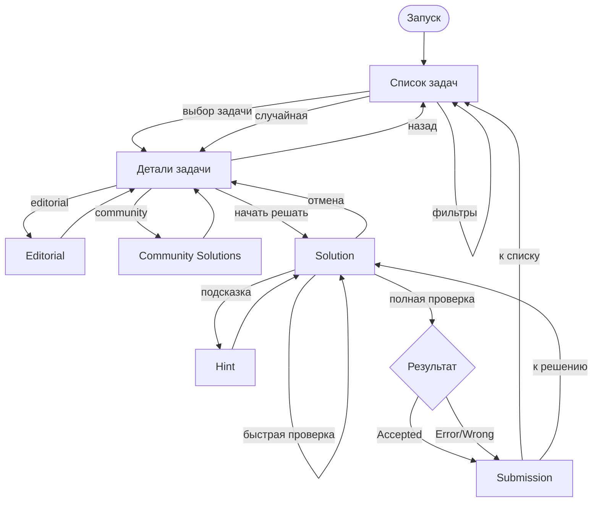
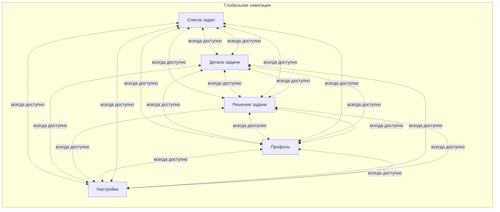
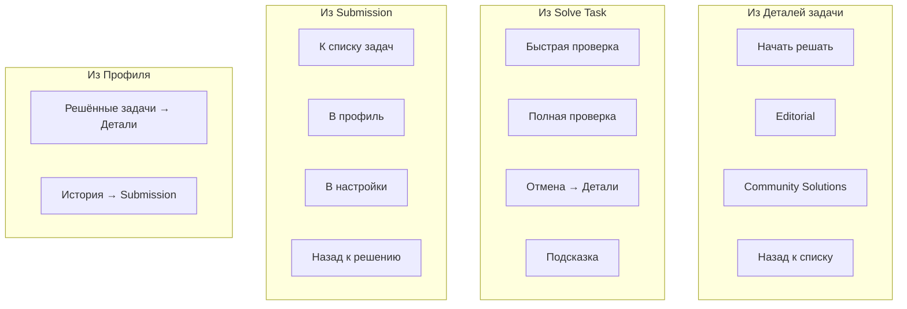

# Sitemap: Информационная Архитектура PracticeRaptor

## 1. Обзор

Данный документ описывает структуру разделов, навигационные связи и пользовательские сценарии платформы PracticeRaptor. Структура унифицирована для всех интерфейсов (CLI, Telegram Bot, Web).

---

## 2. Иерархия Разделов

```
PracticeRaptor
│
├── Список задач (Problems List)
│   ├── Поиск по названию
│   ├── Быстрые фильтры ()
│   ├── Случайная задача
│   └── [Пагинация]
│
├── Детали задачи (Problem)
│   ├── Описание
│   ├── Примеры
│   ├── Сигнатура функции
│   ├── Теги
│   ├── Сложность
│   ├── Эталонное решение (Editorial) — теория + разбор
│   ├── Community Solutions
│   │   └── [Пагинация]
│   └── Начать решать → [Solution]
│
├── Решение задачи (Solution)
│   ├── Редактор кода
│   ├── Выбор языка программирования
│   ├── Получить подсказку (Hint)
│   ├── Быстрая проверка (a few cases)
│   └── Полная проверка (all cases) → [Submission]
│
├── Результат решения (Submission)
│   ├── Статус (Accepted / Wrong Answer / Error / Timeout)
│   ├── Статистика (время выполнения, память)
│   ├── Код решения
│   └── Навигация
│       ├── К списку задач
│       ├── В профиль
│       └── В настройки
│
├── Профиль (Profile)
│   ├── Прогресс (общее количество решенных задач)
│   ├── Статистика
│   │   ├── По сложности
│   │   ├── По темам
│   │   └── По языкам программирования
│   ├── Решённые задачи 
│   │   └── [Пагинация]
│   └── История решений (Submissions)
│
└── Настройки (Settings)
    ├── Фильтры
    │   ├── По сложности (Easy, Medium, Hard)
    │   ├── По темам (Arrays, Strings, DP, ...)
    │   └── По статусу (checkbox: Solved, Unsolved)
    ├── Настройка пагинации (выводить по Х задач)
    └── Язык интерфейса (i18n)
```

---

## 3. Точки входа

Все интерфейсы имеют единую точку входа — **Список задач**.

| Интерфейс | Точка входа | Описание |
|-----------|-------------|----------|
| CLI (REPL) | `$ practiceraptor` → `>` | Запуск REPL, команды без префикса |
| Telegram | `/start` | Сразу показывает список задач |
| Web | `/` | Редирект на `/problems` |

### CLI REPL-режим

```bash
$ practiceraptor
Welcome to PracticeRaptor!

> help                    # справка
> list                    # список задач
> list --difficulty easy  # с быстрым фильтром
> profile                 # профиль
> config                  # настройки
> exit                    # выход
```

---

## 4. Статусы задач

| Статус | Индикатор | Описание |
|--------|-----------|----------|
| Solved | ✓ | Есть успешный submission |
| In Progress | ○ | Есть сохранённый draft |
| Unsolved | (пусто) | Задача не начата |

---

## 5. Глобальная навигация

Доступна из любого раздела:

| Раздел | CLI | Telegram | Web |
|--------|-----|----------|-----|
| Список задач | `list` | кнопка "Задачи" | меню / клик на лого |
| Решение задачи | `solve` | кнопка "Решение" | меню |
| Профиль | `profile` | кнопка "Профиль" | меню |
| Настройки | `config` | кнопка "⚙️" | меню |
| Помощь | `help` | `/help` | footer / ? |

---

## 6. Диаграммы навигации

### 6.1. Основной поток (Main Flow)



### 6.2. Глобальная навигация



### 6.3. Контекстная навигация из разделов



---

## 7. Пользовательские сценарии

Детальные пользовательские сценарии вынесены в отдельные документы:

| # | Сценарий | Описание |
|---|----------|----------|
| 1 | [Первое решение задачи](../user_journeys/01_first_problem_solution.md) | Полный путь от запуска до Accepted |
| 2 | [Использование подсказки](../user_journeys/02_using_hints.md) | Получение помощи при застревании |
| 3 | [Просмотр прогресса](../user_journeys/03_viewing_progress.md) | Анализ статистики и планирование |
| 4 | [Изменение настроек](../user_journeys/04_changing_settings.md) | Настройка языка, фильтров, i18n |
| 5 | [Случайная задача](../user_journeys/05_random_problem.md) | Быстрый выбор для практики |

См. [User Journeys README](../user_journeys/README.md) для обзора всех сценариев.

---

## 8. Маппинг на интерфейсы

| Действие | CLI (REPL) | Telegram | Web |
|----------|------------|----------|-----|
| Список задач | `list [filters]` | inline-кнопки фильтров | `/problems?filters` |
| Детали задачи | `show <slug>` | inline-кнопка | `/problems/:slug` |
| Начать решать | `solve` | кнопка "Решать" | `/problems/:slug/solve` |
| Быстрая проверка | `check` | кнопка "Проверить" | кнопка UI |
| Полная проверка | `submit` | кнопка "Отправить" | кнопка UI |
| Подсказка | `hint` | кнопка "Подсказка" | кнопка UI |
| Editorial | `editorial` | кнопка "Разбор" | tab/кнопка |
| Community | `community` | кнопка "Решения" | tab/кнопка |
| Профиль | `profile` | `/profile` | `/profile` |
| Настройки | `config [key] [value]` | `/settings` | `/settings` |
| Случайная | `random` | кнопка "🎲" | кнопка UI |
| Помощь | `help` | `/help` | `/help` |
| Выход | `exit` | — | — |

---

## 9. Доступ к решениям и подсказкам

| Раздел | Доступность |
|--------|-------------|
| Hint | Всегда доступен |
| Editorial | Всегда доступен |
| Community Solutions | Всегда доступны |

> **Примечание:** Философия PracticeRaptorФилософия: пользователь сам решает, когда ему нужна помощь.

---

## 10. Связанные документы

- [Core UX Principles](../core_ux_principles.md)
- [User Persona](../user_persona.md)
- [User Journeys](../user_journeys/README.md)
- [Information Architecture README](./README.md)
