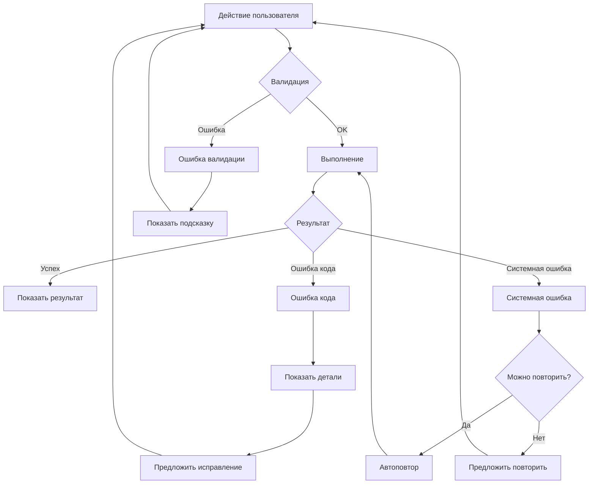

# Паттерны обработки ошибок (Error Handling Patterns)

## 1. Обзор

Ошибки неизбежны, но хорошая обработка ошибок превращает негативный опыт в возможность обучения. Цель — помочь пользователю понять, что произошло, и как это исправить.

---

## 2. Классификация ошибок

### 2.1. По источнику

| Категория | Описание | Пример |
|-----------|----------|--------|
| **Пользовательские** | Ошибки в коде/действиях пользователя | Wrong Answer, Syntax Error |
| **Системные** | Проблемы инфраструктуры | Network Error, Server Error |
| **Валидационные** | Некорректный ввод | Invalid command, Missing argument |

### 2.2. По критичности

| Уровень | Описание | Реакция системы |
|---------|----------|-----------------|
| **Критическая** | Невозможно продолжить | Остановка, сообщение, помощь |
| **Серьёзная** | Операция не выполнена | Сообщение, варианты решения |
| **Предупреждение** | Потенциальная проблема | Уведомление, продолжение |
| **Информационная** | Подсказка | Hint, не блокирует |

---

## 3. Ошибки выполнения кода

### 3.1. Wrong Answer

Код выполнился, но результат неверный.

**Структура сообщения:**
1. Статус (Wrong Answer)
2. Номер теста
3. Входные данные (если не секретные)
4. Ожидаемый результат
5. Полученный результат
6. Подсказка (опционально)

**CLI:**
```
╔═══════════════════════════════════════════════════════════╗
║  ✗ Wrong Answer                                           ║
╠═══════════════════════════════════════════════════════════╣
║  Тест 3/15 не пройден                                     ║
║                                                           ║
║  Вход:     nums = [3, 2, 4], target = 6                   ║
║  Ожидалось: [1, 2]                                        ║
║  Получено:  [0, 2]                                        ║
║                                                           ║
║  💡 Подсказка: Проверьте индексы возвращаемых элементов   ║
╚═══════════════════════════════════════════════════════════╝

Команды: [solve] редактировать  [hint] подсказка  [back] назад
```

**Telegram:**
```
❌ Wrong Answer

Тест 3/15 не пройден

📥 Вход:
nums = [3, 2, 4], target = 6

✅ Ожидалось: [1, 2]
❌ Получено: [0, 2]

💡 Проверьте индексы возвращаемых элементов

[🔄 Попробовать снова] [💡 Подсказка]
```

---

### 3.2. Runtime Error

Исключение во время выполнения.

**Структура сообщения:**
1. Статус (Runtime Error)
2. Тип ошибки (IndexError, TypeError, etc.)
3. Сообщение ошибки
4. Строка кода (если доступна)
5. Stacktrace (свёрнутый)

**CLI:**
```
╔═══════════════════════════════════════════════════════════╗
║  ✗ Runtime Error                                          ║
╠═══════════════════════════════════════════════════════════╣
║  IndexError: list index out of range                      ║
║                                                           ║
║  Строка 5: return nums[left], nums[right]                 ║
║                        ^^^^                               ║
║                                                           ║
║  💡 Проверьте границы массива перед обращением            ║
╚═══════════════════════════════════════════════════════════╝

[Показать полный traceback? y/n]
```

**Telegram:**
```
❌ Runtime Error

IndexError: list index out of range

📍 Строка 5:
return nums[left], nums[right]
            ^^^^

💡 Проверьте границы массива перед обращением

[📋 Полный traceback] [🔄 Исправить]
```

---

### 3.3. Time Limit Exceeded (TLE)

Код выполняется слишком долго.

**CLI:**
```
╔═══════════════════════════════════════════════════════════╗
║  ⏱️  Time Limit Exceeded                                   ║
╠═══════════════════════════════════════════════════════════╣
║  Тест 10/15: превышен лимит времени (2000ms)              ║
║                                                           ║
║  Ваше решение: > 2000ms                                   ║
║  Лимит:        2000ms                                     ║
║                                                           ║
║  💡 Попробуйте оптимизировать алгоритм.                   ║
║     Текущая сложность вероятно O(n²), нужна O(n log n)    ║
╚═══════════════════════════════════════════════════════════╝
```

---

### 3.4. Memory Limit Exceeded (MLE)

Код использует слишком много памяти.

**CLI:**
```
╔═══════════════════════════════════════════════════════════╗
║  💾 Memory Limit Exceeded                                 ║
╠═══════════════════════════════════════════════════════════╣
║  Использовано: > 256 MB                                   ║
║  Лимит:        256 MB                                     ║
║                                                           ║
║  💡 Проверьте, нет ли утечек памяти или избыточных        ║
║     структур данных                                       ║
╚═══════════════════════════════════════════════════════════╝
```

---

### 3.5. Compilation/Syntax Error

Код не может быть выполнен из-за синтаксической ошибки.

**CLI:**
```
╔═══════════════════════════════════════════════════════════╗
║  ✗ Syntax Error                                           ║
╠═══════════════════════════════════════════════════════════╣
║  SyntaxError: invalid syntax                              ║
║                                                           ║
║  Строка 3: def two_sum(nums, target)                      ║
║                                     ^                     ║
║            Ожидается ':'                                  ║
╚═══════════════════════════════════════════════════════════╝
```

---

## 4. Ошибки валидации

### 4.1. Неизвестная команда

**CLI:**
```
> slove
✗ Неизвестная команда: 'slove'

Возможно, вы имели в виду: solve

Введите 'help' для списка доступных команд.
```

### 4.2. Отсутствующий аргумент

**CLI:**
```
> show
✗ Ошибка: требуется указать задачу

Использование: show <problem-slug>
Пример:        show two-sum

Введите 'list' для просмотра доступных задач.
```

### 4.3. Некорректное значение

**CLI:**
```
> config language ruby
✗ Ошибка: язык 'ruby' не поддерживается

Доступные языки: python, go, javascript, java
```

---

## 5. Системные ошибки

### 5.1. Сетевая ошибка

**CLI:**
```
✗ Ошибка сети: не удалось подключиться к серверу

Проверьте интернет-соединение и попробуйте снова.
[r] повторить  [q] выйти
```

**Telegram:**
```
❌ Ошибка соединения

Не удалось связаться с сервером.
Пожалуйста, попробуйте позже.

[🔄 Повторить]
```

### 5.2. Серверная ошибка

**CLI:**
```
✗ Ошибка сервера (500)

Что-то пошло не так на нашей стороне.
Мы уже работаем над исправлением.

ID ошибки: err_abc123 (сообщите в поддержку)
```

### 5.3. Таймаут

**CLI:**
```
⏱️  Превышено время ожидания ответа

Сервер не ответил вовремя.
[r] повторить  [q] отменить
```

---

## 6. Паттерны восстановления

### 6.1. Автоматическое восстановление

Для временных ошибок — автоматический retry:

```
⏳ Отправляю решение...
⚠️  Ошибка сети, повторяю (1/3)...
⚠️  Ошибка сети, повторяю (2/3)...
✓ Отправлено!
```

### 6.2. Предложение действий

После ошибки предлагать варианты:

```
✗ Задача 'tow-sum' не найдена

Возможно, вы искали:
  1. two-sum
  2. 3sum
  3. two-sum-ii

Выберите [1-3] или введите другой запрос:
```

### 6.3. Сохранение состояния

При ошибке не терять пользовательские данные:

```
✗ Не удалось отправить решение

Ваш код сохранён. Используйте 'solve' для продолжения.
```

---

## 7. Диаграмма обработки ошибок



---

## 8. Формат сообщений об ошибках

### 8.1. Структура

```
[Иконка] [Тип ошибки]

[Что произошло — краткое описание]

[Детали — если нужны]

[Как исправить — рекомендация]

[Доступные действия]
```

### 8.2. Пример

```
✗ Wrong Answer

Тест 3 из 15 не пройден.

Вход:     [3, 2, 4], target = 6
Ожидалось: [1, 2]
Получено:  [0, 2]

💡 Проверьте, что возвращаете индексы, а не значения.

[solve] редактировать  [hint] подсказка  [skip] пропустить
```

---

## 9. Принципы хорошей обработки ошибок

### 9.1. Ясность

```
✓ Хорошо: "Индекс 5 выходит за границы массива (размер: 3)"
✗ Плохо:  "IndexError"
```

### 9.2. Конструктивность

```
✓ Хорошо: "Попробуйте использовать hash-table для O(n)"
✗ Плохо:  "Неправильно, подумайте ещё"
```

### 9.3. Без обвинений

```
✓ Хорошо: "Команда не распознана"
✗ Плохо:  "Вы ввели неправильную команду"
```

### 9.4. Предложение решения

```
✓ Хорошо: "Язык 'ruby' не поддерживается. Доступны: python, go"
✗ Плохо:  "Неверный язык"
```

---

## 10. Локализация ошибок

| Код | English | Русский |
|-----|---------|---------|
| `ERR_WRONG_ANSWER` | Wrong Answer | Неверный ответ |
| `ERR_RUNTIME` | Runtime Error | Ошибка выполнения |
| `ERR_TIMEOUT` | Time Limit Exceeded | Превышен лимит времени |
| `ERR_MEMORY` | Memory Limit Exceeded | Превышен лимит памяти |
| `ERR_SYNTAX` | Syntax Error | Синтаксическая ошибка |
| `ERR_NETWORK` | Network Error | Ошибка сети |
| `ERR_SERVER` | Server Error | Ошибка сервера |
| `ERR_NOT_FOUND` | Not Found | Не найдено |
| `ERR_INVALID_ARG` | Invalid Argument | Неверный аргумент |

---

## 11. Связанные документы

- [Обратная связь](./feedback.md)
- [Модели взаимодействия](./interaction_models.md)
