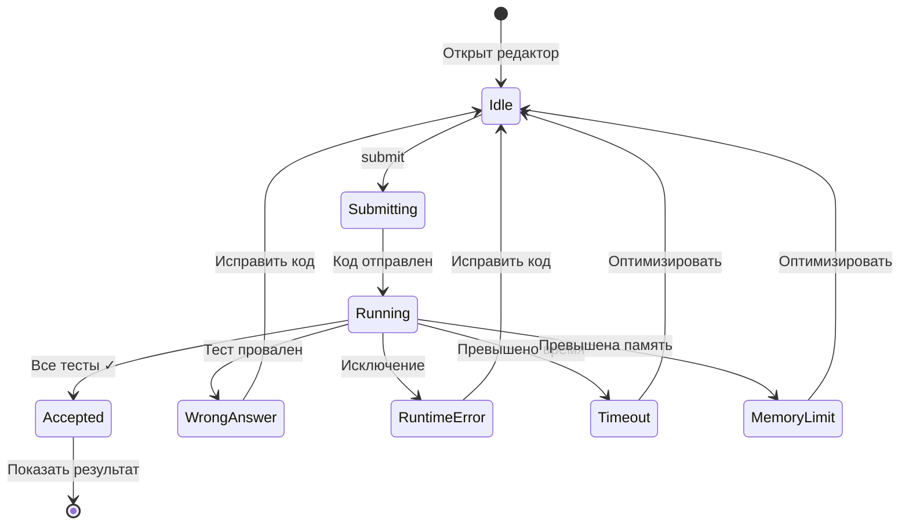

# Паттерны обратной связи (Feedback Patterns)

## 1. Обзор

Обратная связь — это способ, которым система сообщает пользователю о результатах его действий и текущем состоянии. Правильная обратная связь создаёт ощущение контроля и понимания происходящего.

---

## 2. Типы обратной связи

### 2.1. Статусы выполнения кода

Основные статусы результата проверки решения:

| Статус | Описание | Визуализация |
|--------|----------|--------------|
| **Accepted** | Все тесты пройдены | ✅ Зелёный |
| **Wrong Answer** | Неверный результат | ❌ Красный |
| **Runtime Error** | Ошибка выполнения | ❌ Красный |
| **Time Limit Exceeded** | Превышен лимит времени | ⏱️ Жёлтый |
| **Memory Limit Exceeded** | Превышен лимит памяти | 💾 Жёлтый |
| **Compilation Error** | Синтаксическая ошибка | ❌ Красный |

#### Примеры по интерфейсам

**CLI:**
```
╔═══════════════════════════════════════════════════════════╗
║  ✓ Accepted!                                              ║
╠═══════════════════════════════════════════════════════════╣
║  Runtime: 52ms    (beats 85% of submissions)              ║
║  Memory:  14.2 MB (beats 72% of submissions)              ║
╚═══════════════════════════════════════════════════════════╝
```

```
╔═══════════════════════════════════════════════════════════╗
║  ✗ Wrong Answer                                           ║
╠═══════════════════════════════════════════════════════════╣
║  Failed on test 3/15                                      ║
║                                                           ║
║  Input:    [3, 2, 4], target = 6                          ║
║  Expected: [1, 2]                                         ║
║  Got:      [0, 2]                                         ║
╚═══════════════════════════════════════════════════════════╝
```

**Telegram:**
```
✅ Accepted!

⏱️ Время: 52ms
💾 Память: 14.2 MB

[📚 К задачам] [👤 Профиль] [▶️ Следующая]
```

```
❌ Wrong Answer

Тест 3/15 не пройден:
• Вход: [3, 2, 4], target = 6
• Ожидалось: [1, 2]
• Получено: [0, 2]

[🔄 Попробовать снова] [💡 Подсказка]
```

**Web:**
```html
<!-- Accepted -->
<div class="result-card result-success">
  <h2>✓ Accepted</h2>
  <div class="stats">
    <span class="runtime">52ms</span>
    <span class="memory">14.2 MB</span>
  </div>
</div>

<!-- Wrong Answer -->
<div class="result-card result-error">
  <h2>✗ Wrong Answer</h2>
  <div class="test-details">
    <p>Test 3/15 failed</p>
    <code>Input: [3, 2, 4], target = 6</code>
    <code>Expected: [1, 2]</code>
    <code>Got: [0, 2]</code>
  </div>
</div>
```

---

### 2.2. Индикаторы прогресса

#### 2.2.1. Прогресс проверки

Показывает текущий статус выполнения тестов.

**CLI:**
```
Running tests...
  Test  1/15: ✓
  Test  2/15: ✓
  Test  3/15: ✓
  Test  4/15: ⏳ running...
```

С progress bar:
```
Running tests... [████████░░░░░░░░] 8/15 (53%)
```

**Telegram:**
```
⏳ Проверяю решение...

Тесты: ████████░░░░ 8/15
```

**Web:**
```
┌─────────────────────────────────────┐
│  Running tests...                   │
│  ████████████░░░░░░░░  8/15  53%   │
└─────────────────────────────────────┘
```

#### 2.2.2. Прогресс пользователя

Отображение общего прогресса решения задач.

**CLI:**
```
Прогресс: 22/150 задач

Easy:   ██████████░░░░░░░░░░ 15/50  (30%)
Medium: ████░░░░░░░░░░░░░░░░  6/70  ( 9%)
Hard:   █░░░░░░░░░░░░░░░░░░░  1/30  ( 3%)
```

**Telegram:**
```
📊 Твой прогресс: 22/150

🟢 Easy:   15/50 (30%)
🟡 Medium:  6/70 (9%)
🔴 Hard:    1/30 (3%)
```

---

### 2.3. Уведомления

#### Типы уведомлений

| Тип | Иконка | Цвет | Использование |
|-----|--------|------|---------------|
| Успех | ✓ ✅ | Зелёный | Операция выполнена |
| Ошибка | ✗ ❌ | Красный | Операция не удалась |
| Предупреждение | ⚠️ | Жёлтый | Требуется внимание |
| Информация | ℹ️ | Синий | Полезная информация |
| Подсказка | 💡 | Cyan | Совет пользователю |

#### Примеры

**Успех:**
```
CLI:      ✓ Настройки сохранены
Telegram: ✅ Настройки сохранены
Web:      [toast] Настройки сохранены
```

**Ошибка:**
```
CLI:      ✗ Ошибка: задача не найдена
Telegram: ❌ Задача не найдена
Web:      [toast] Задача не найдена
```

**Предупреждение:**
```
CLI:      ⚠️  У вас есть несохранённые изменения
Telegram: ⚠️ Несохранённые изменения будут потеряны
Web:      [modal] Вы уверены? Изменения будут потеряны.
```

**Информация:**
```
CLI:      ℹ️  Используйте 'help' для списка команд
Telegram: ℹ️ Отправьте код сообщением для проверки
Web:      [tooltip] Нажмите Ctrl+Enter для отправки
```

---

### 2.4. Состояния загрузки

#### 2.4.1. Спиннеры и индикаторы

**CLI:**
```
⏳ Загрузка списка задач...
```

Анимированный спиннер:
```
⠋ Загрузка...
⠙ Загрузка...
⠹ Загрузка...
⠸ Загрузка...
```

**Telegram:**
```
⏳ Загружаю...
```

**Web:**
```
[skeleton loading] или [spinner]
```

#### 2.4.2. Длительные операции

Для операций > 2 секунд показывать прогресс:

```
⏳ Проверяю решение на 15 тестах...
   Тест 5/15 выполняется...
```

---

### 2.5. Подтверждения действий

#### Мгновенное подтверждение

Для быстрых операций — мгновенный feedback:

```
> config language go
✓ Язык изменён на: go
```

#### Отложенное подтверждение

Для операций с задержкой — индикатор + результат:

```
> submit
⏳ Отправляю решение...
✓ Решение принято! Проверяю...
  [progress bar]
✓ Accepted!
```

---

## 3. Временные характеристики

| Операция | Ожидаемое время | Feedback |
|----------|-----------------|----------|
| Мгновенная (< 100ms) | Немедленно | Результат сразу |
| Быстрая (100ms - 1s) | До 1 секунды | Spinner/индикатор |
| Средняя (1s - 5s) | До 5 секунд | Progress bar |
| Долгая (> 5s) | Более 5 секунд | Progress + ETA |

---

## 4. Звуковая обратная связь (опционально)

| Событие | Звук | Настройка |
|---------|------|-----------|
| Accepted | Успешный звук | `sound.accepted` |
| Wrong Answer | Ошибка | `sound.error` |
| Уведомление | Ping | `sound.notification` |

> По умолчанию отключено. Включается в настройках.

---

## 5. Диаграмма состояний проверки



---

## 6. Принципы хорошей обратной связи

### 6.1. Немедленность

Пользователь должен знать, что система приняла его действие:

```
✓ Хорошо: Нажал Enter → сразу появился спиннер
✗ Плохо:  Нажал Enter → ничего 3 секунды → результат
```

### 6.2. Информативность

Сообщения должны быть полезными:

```
✓ Хорошо: "Wrong Answer: Expected [0,1], got [1,0]"
✗ Плохо:  "Error"
```

### 6.3. Позитивность

Даже ошибки формулировать конструктивно:

```
✓ Хорошо: "Тест 3 не пройден. Проверьте порядок элементов."
✗ Плохо:  "Неправильно!"
```

### 6.4. Консистентность

Одинаковые события — одинаковый feedback:

```
✓ Хорошо: Accepted всегда с ✓ и зелёным
✗ Плохо:  Иногда "OK", иногда "Success", иногда "Accepted"
```

---

## 7. Связанные документы

- [Обработка ошибок](./error_handling.md)
- [User Journeys](../user_journeys/README.md)
