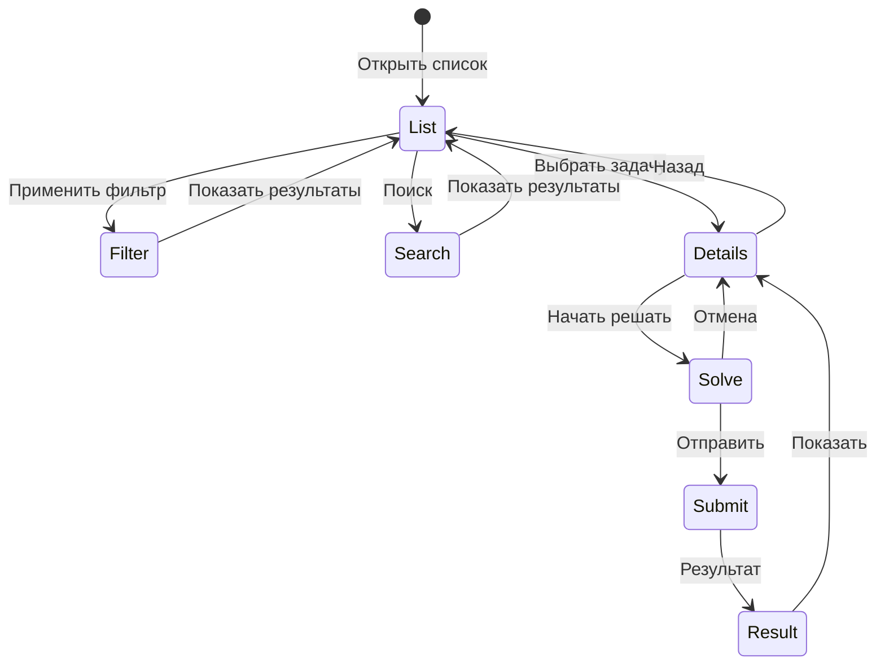
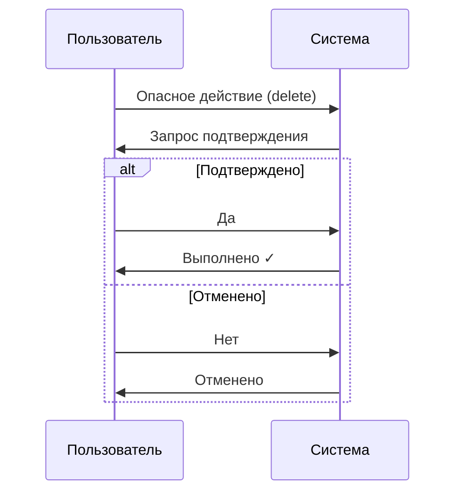

# Модели взаимодействия (Interaction Models)

## 1. Обзор

Модели взаимодействия определяют, как пользователь общается с системой: выбирает опции, подтверждает действия, отменяет операции и навигирует между разделами.

---

## 2. Базовые модели

### 2.1. Выбор (Selection)

#### Выбор из списка

**CLI (нумерованный):**
```
Выберите сложность:
  1. Easy
  2. Medium
  3. Hard
  4. Все

Ваш выбор [1-4]: 2
```

**CLI (интерактивный с arrow keys):**
```
Выберите сложность:
    Easy
  > Medium     ← используйте ↑↓ для выбора, Enter для подтверждения
    Hard
    Все
```

**Telegram:**
```
Выберите сложность:

[Easy] [Medium] [Hard]
[Все]
```

**Web:**
```
┌─────────────────┐
│ Сложность    ▼  │
├─────────────────┤
│ ○ Easy          │
│ ● Medium        │
│ ○ Hard          │
│ ○ Все           │
└─────────────────┘
```

#### Множественный выбор

**CLI:**
```
Выберите темы (через запятую или пробел):
  1. Arrays
  2. Strings
  3. Hash Table
  4. Trees
  5. DP

Ваш выбор [1-5, можно несколько]: 1, 3
```

**Telegram:**
```
Выберите темы (можно несколько):

[✓ Arrays] [Strings] [✓ Hash Table]
[Trees] [DP]

[✅ Готово]
```

---

### 2.2. Подтверждение (Confirmation)

#### Простое подтверждение

**CLI:**
```
Удалить все черновики? [y/N]: y
✓ Черновики удалены
```

**Telegram:**
```
⚠️ Удалить все черновики?

Это действие нельзя отменить.

[✅ Да, удалить] [❌ Отмена]
```

**Web:**
```
┌─────────────────────────────────────┐
│  ⚠️ Удалить все черновики?          │
│                                     │
│  Это действие нельзя отменить.      │
│                                     │
│  [Отмена]  [Удалить]                │
└─────────────────────────────────────┘
```

#### Подтверждение с вводом

Для критически важных действий:

**CLI:**
```
⚠️  Это удалит ВСЮ историю решений!

Для подтверждения введите 'DELETE': DELETE
✓ История удалена
```

---

### 2.3. Отмена (Cancellation)

#### Отмена текущего действия

**CLI:**
```
> solve
[Opening editor...]

# В редакторе: Ctrl+C или :q! без сохранения

Редактирование отменено. Черновик сохранён.
```

**Telegram:**
```
✏️ Режим решения: Two Sum

Отправьте код решения.

[❌ Отмена]
```

*Нажатие «Отмена»:*
```
✓ Решение отменено

[📚 К задачам] [📝 Детали задачи]
```

#### Отмена в процессе

**CLI:**
```
⏳ Проверяю решение... (Ctrl+C для отмены)
  Test 1/15: ✓
  Test 2/15: ✓
^C
⚠️  Проверка отменена
```

---

### 2.4. Навигация (Navigation)

#### Иерархическая навигация

**CLI:**
```
Текущее местоположение: Детали задачи > Two Sum

Команды: [solve] решать  [back] назад к списку  [home] главная
```

#### Глобальная навигация

Доступна из любого места:

**CLI:**
```
> list      # К списку задач
> profile   # К профилю
> config    # К настройкам
> help      # Помощь
```

**Telegram:**
Persistent keyboard или inline buttons:
```
[📚 Задачи] [👤 Профиль] [⚙️ Настройки]
```

#### Контекстная навигация

Зависит от текущего раздела:

**В деталях задачи:**
```
[solve] [hint] [editorial] [community] [back]
```

**В режиме решения:**
```
[check] [submit] [hint] [cancel]
```

---

### 2.5. Ввод данных (Input)

#### Однострочный ввод

**CLI:**
```
> show two-sum
> config language go
> list --difficulty=easy
```

#### Многострочный ввод (код)

**CLI (внешний редактор):**
```
> solve
[Opening vim...]

# Пользователь пишет код в vim
# Сохраняет и выходит

[Code saved. 15 lines.]
```

**Telegram:**
```
✏️ Отправьте код решения сообщением:
```

*Пользователь отправляет:*
```python
def two_sum(nums, target):
    seen = {}
    for i, n in enumerate(nums):
        if target - n in seen:
            return [seen[target - n], i]
        seen[n] = i
```

#### Поиск

**CLI:**
```
> list --search="two sum"
Найдено 3 задачи:
  1. Two Sum
  2. Two Sum II
  3. Two Sum III
```

**Web:**
```
┌─────────────────────────────────────┐
│ 🔍 two sum                     [×]  │
└─────────────────────────────────────┘
```

---

### 2.6. Пагинация (Pagination)

#### Постраничная навигация

**CLI:**
```
Показано 1-10 из 150 задач

[n] следующая страница
[p] предыдущая страница
[g] перейти к странице
[q] выход

>
```

**CLI (с номером страницы):**
```
> list --page=5
Показано 41-50 из 150 задач (страница 5/15)
```

**Telegram:**
```
Страница 1/15

[◀️ Назад] [1] [2] [3] ... [15] [▶️ Далее]
```

**Web:**
```
[< Prev] [1] [2] [3] ... [15] [Next >]
```

#### Бесконечная прокрутка (Web)

```
┌─────────────────┐
│ Задача 1        │
│ Задача 2        │
│ Задача 3        │
│ ...             │
│ Задача 10       │
│ [Загрузка...]   │  ← автозагрузка при скролле
└─────────────────┘
```

---

## 3. Состояния взаимодействия

### 3.1. Idle (Ожидание)

Система готова к вводу:

**CLI:**
```
>                    ← курсор мигает
```

### 3.2. Processing (Обработка)

Система выполняет операцию:

**CLI:**
```
⏳ Загрузка...       ← спиннер анимирован
```

### 3.3. Waiting for Input (Ожидание ввода)

Система ждёт действия пользователя:

**CLI:**
```
Продолжить? [y/N]: _
```

### 3.4. Error (Ошибка)

Требуется реакция на ошибку:

**CLI:**
```
✗ Ошибка: задача не найдена

Команды: [list] показать задачи  [help] справка
>
```

---

## 4. Горячие клавиши (CLI)

### 4.1. Глобальные

| Клавиша | Действие |
|---------|----------|
| `Ctrl+C` | Отмена текущей операции |
| `Ctrl+D` | Выход из приложения |
| `Tab` | Автодополнение |
| `↑` / `↓` | История команд |

### 4.2. В режиме выбора

| Клавиша | Действие |
|---------|----------|
| `↑` / `↓` | Перемещение по списку |
| `Enter` | Подтверждение выбора |
| `Esc` | Отмена |
| `Space` | Переключить (для множественного выбора) |

### 4.3. В режиме просмотра

| Клавиша | Действие |
|---------|----------|
| `n` | Следующая страница |
| `p` | Предыдущая страница |
| `q` | Выход / назад |
| `/` | Поиск |

---

## 5. Жесты (Telegram / Web Mobile)

| Жест | Действие |
|------|----------|
| Tap | Выбор элемента |
| Long press | Контекстное меню |
| Swipe left | Удалить / действие |
| Swipe right | Действие |
| Pull to refresh | Обновить |

---

## 6. Диаграммы взаимодействия

### 6.1. Процесс выбора задачи



### 6.2. Процесс подтверждения



---

## 7. Обработка ошибок взаимодействия

### 7.1. Неверный ввод

**CLI:**
```
> config language ruby
✗ Ошибка: 'ruby' не поддерживается

Доступные языки: python, go, javascript, java
> config language _
```

### 7.2. Таймаут ожидания

**CLI:**
```
Продолжить? [y/N]:
⚠️  Время ожидания истекло. Выбрано: N (по умолчанию)
```

### 7.3. Прерывание

**CLI:**
```
⏳ Загрузка списка задач...
^C
⚠️  Операция прервана
>
```

---

## 8. Адаптация под интерфейсы

### 8.1. CLI

| Модель | Реализация |
|--------|------------|
| Выбор | Нумерация + ввод или arrow keys |
| Подтверждение | `[y/N]` prompt |
| Отмена | `Ctrl+C`, `q`, `Esc` |
| Навигация | Команды текстом |
| Пагинация | `[n]` / `[p]` или `--page=N` |

### 8.2. Telegram

| Модель | Реализация |
|--------|------------|
| Выбор | Inline buttons |
| Подтверждение | Кнопки Да/Нет |
| Отмена | Кнопка «Отмена» |
| Навигация | Inline buttons + команды |
| Пагинация | Кнопки ◀️ ▶️ |

### 8.3. Web

| Модель | Реализация |
|--------|------------|
| Выбор | Dropdown, radio, checkbox |
| Подтверждение | Modal dialog |
| Отмена | Кнопка, Esc, клик вне |
| Навигация | Menu, breadcrumbs, links |
| Пагинация | Номера страниц, infinite scroll |

---

## 9. Принципы хорошего взаимодействия

### 9.1. Предсказуемость

Одинаковые действия → одинаковые результаты:

```
✓ Хорошо: [y/N] всегда означает "да/нет"
✗ Плохо:  Иногда [y/N], иногда [Y/n], иногда [yes/no]
```

### 9.2. Обратимость

Возможность отменить или вернуться:

```
✓ Хорошо: Удалить черновик? [y/N] + возможность восстановить
✗ Плохо:  Удаление без подтверждения и без возможности отмены
```

### 9.3. Feedback

Всегда показывать результат действия:

```
✓ Хорошо: > config language go → ✓ Язык изменён на: go
✗ Плохо:  > config language go → (ничего)
```

### 9.4. Доступность

Несколько способов выполнить действие:

```
✓ Хорошо: Выход: 'exit' или 'quit' или 'q' или Ctrl+D
✗ Плохо:  Выход только через 'exit'
```

### 9.5. Значения по умолчанию

Разумные defaults уменьшают когнитивную нагрузку:

```
✓ Хорошо: Продолжить? [Y/n] ← Enter = да (наиболее вероятное)
✗ Плохо:  Продолжить? [y/n] ← нужно явно вводить
```

---

## 10. Связанные документы

- [Обратная связь](./feedback.md)
- [Обработка ошибок](./error_handling.md)
- [Представление данных](./data_presentation.md)
