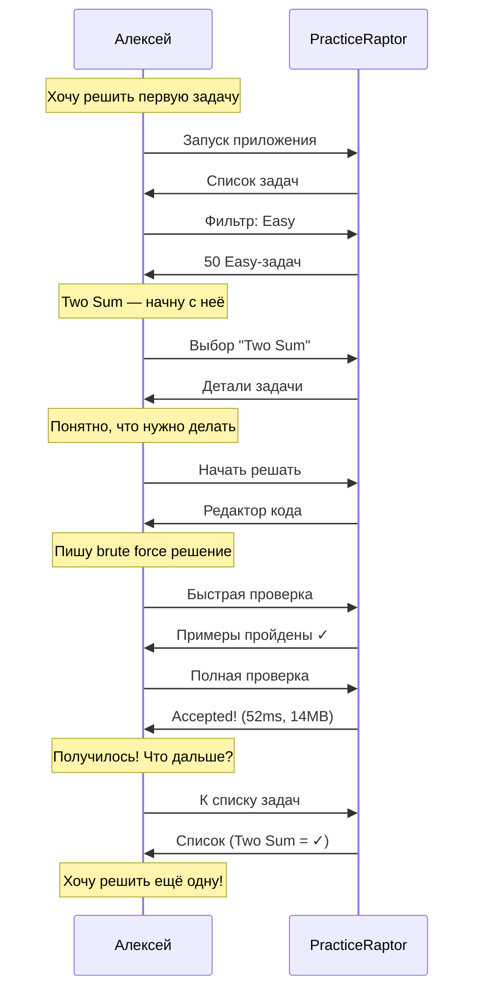

# Сценарий 1: Первое решение задачи

## 1. Контекст и мотивация

### Ситуация

Алексей недавно установил PracticeRaptor и хочет решить свою первую задачу. Он готовится к собеседованию в IT-компанию и знает, что там будут алгоритмические задачи. У него есть 30-40 минут свободного времени между парами.

### Внутренний монолог

> «Хочу начать с чего-то простого, чтобы понять, как работает платформа. Не хочу сразу браться за сложное и разочароваться. Посмотрю Easy-задачи — если быстро решу, будет мотивация продолжать.»

### Эмоциональное состояние

- **В начале:** Лёгкое волнение, любопытство
- **Ожидание:** Простой старт, быстрый результат
- **Риск:** Если интерфейс сложный или задача непонятная — может бросить

---

## 2. Задача пользователя (Job to be Done)

**Когда** я начинаю использовать новую платформу для практики,
**я хочу** быстро решить первую простую задачу,
**чтобы** понять механику работы и почувствовать прогресс.

### Подзадачи

1. Найти подходящую задачу (Easy, понятная тема)
2. Понять условие задачи
3. Написать решение
4. Проверить решение
5. Увидеть результат и подтверждение успеха

---

## 3. Предусловия

| Условие | Статус |
|---------|--------|
| PracticeRaptor установлен | ✓ |
| Пользователь запустил приложение | ✓ |
| Задачи в каталоге доступны | ✓ |
| Нет ранее решённых задач | ✓ (первый запуск) |

---

## 4. Пошаговые действия

### Шаг 1: Запуск и ориентация

**Действие:** Алексей запускает PracticeRaptor.

**Мысли:** «Что тут есть? Как начать?»

**Система показывает:** Список задач (точка входа по умолчанию).

**Результат:** Алексей сразу видит, что можно делать — выбирать задачи.

---

### Шаг 2: Фильтрация по сложности

**Действие:** Алексей ищет способ показать только лёгкие задачи.

**Мысли:** «Где тут фильтр? Хочу только Easy.»

**Система предоставляет:** Очевидный способ фильтрации (команда/кнопка/UI).

**Результат:** Список сужается до Easy-задач.

---

### Шаг 3: Выбор задачи

**Действие:** Алексей просматривает список и выбирает знакомую тему.

**Мысли:** «Two Sum — слышал про неё, классика. Начну с неё.»

**Критерии выбора:**
- Знакомое название или тема
- Понятные теги (array, hash-table)
- Отсутствие пугающих слов (dynamic programming, graph)

**Результат:** Переход к деталям задачи.

---

### Шаг 4: Изучение условия

**Действие:** Алексей читает описание задачи.

**Мысли:** «Ага, нужно найти два числа, которые в сумме дают target. Примеры понятны.»

**Что важно увидеть:**
- Чёткое описание
- Примеры с входными данными и ожидаемым результатом
- Сигнатура функции (что принимает, что возвращает)

**Результат:** Алексей понимает задачу и готов решать.

---

### Шаг 5: Переход к решению

**Действие:** Алексей нажимает «Начать решать» / вводит команду `solve`.

**Мысли:** «Ок, давай попробуем.»

**Система предоставляет:**
- Редактор кода (или открытие внешнего редактора в CLI)
- Сигнатура функции уже на месте
- Возможность видеть условие (в CLI — закомментировано в файле)

**Результат:** Алексей в режиме написания кода.

---

### Шаг 6: Написание решения

**Действие:** Алексей пишет код решения.

**Мысли:** «Попробую brute force сначала — два цикла. Работает? Проверю.»

**Поведение:**
- Пишет первую версию (возможно, неоптимальную)
- Хочет быстро проверить, работает ли вообще

**Результат:** Код готов к проверке.

---

### Шаг 7: Быстрая проверка

**Действие:** Алексей запускает быструю проверку (на примерах).

**Мысли:** «Сначала проверю на примерах, потом отправлю на полные тесты.»

**Система показывает:**
- Прогресс выполнения
- Результат: примеры пройдены ✓ или ошибка ✗

**Сценарий A — успех:** «Отлично, примеры прошли!»
**Сценарий B — ошибка:** «Хм, что не так? Посмотрю вывод...» → возврат к шагу 6

**Результат:** Примеры пройдены, Алексей готов к полной проверке.

---

### Шаг 8: Полная проверка

**Действие:** Алексей отправляет решение на полную проверку.

**Мысли:** «Надеюсь, пройдёт. Посмотрим...»

**Система показывает:**
- Прогресс (тесты 1/10, 2/10...)
- Итоговый результат

**Возможные исходы:**

| Результат | Реакция пользователя | Действие системы |
|-----------|---------------------|------------------|
| Accepted | «Да! Получилось!» | Переход к Submission |
| Wrong Answer | «Где ошибка?» | Показать failed тест |
| Timeout | «Слишком медленно...» | Показать лимит времени |
| Error | «Что сломалось?» | Показать traceback |

**Результат:** Accepted! Переход к экрану Submission.

---

### Шаг 9: Просмотр результата

**Действие:** Алексей видит экран успешного решения.

**Мысли:** «Круто! 52ms, 14MB — это хорошо или плохо? Ладно, главное — решил!»

**Система показывает:**
- Статус: Accepted
- Метрики: время выполнения, память
- Код решения
- Варианты навигации: к списку, в профиль, другая задача

**Эмоциональное состояние:** Удовлетворение, мотивация продолжать.

**Результат:** Алексей понимает, что справился, и хочет решить ещё.

---

### Шаг 10: Возврат к списку

**Действие:** Алексей возвращается к списку задач.

**Мысли:** «Посмотрю, что ещё есть. О, Two Sum теперь с галочкой!»

**Система показывает:**
- Обновлённый список
- Two Sum отмечена как ✓ Solved

**Результат:** Цикл завершён, пользователь готов к следующей задаче.

---

## 5. Диаграмма сценария



---

## 6. Примеры интерфейсов

### CLI (REPL)

```bash
$ practiceraptor
Welcome to PracticeRaptor v0.1.0
Type 'help' for available commands.

> list --difficulty=easy

  #   Status  Problem              Difficulty  Tags
  ─────────────────────────────────────────────────────
  1.          Two Sum              Easy        array, hash-table
  2.          Valid Parentheses    Easy        string, stack
  3.          Reverse String       Easy        string, two-pointers
  ...

  Showing 1-10 of 50. Use 'list --page=2' for more.

> show two-sum

╔═══════════════════════════════════════════════════════════╗
║  Two Sum                                         [Easy]   ║
╠═══════════════════════════════════════════════════════════╣
║  Tags: array, hash-table                                  ║
╚═══════════════════════════════════════════════════════════╝

Given an array of integers nums and an integer target, return
indices of the two numbers such that they add up to target.

You may assume that each input would have exactly one solution,
and you may not use the same element twice.

Example 1:
  Input: nums = [2,7,11,15], target = 9
  Output: [0,1]
  Explanation: nums[0] + nums[1] == 9, return [0,1]

Example 2:
  Input: nums = [3,2,4], target = 6
  Output: [1,2]

Commands: [solve] [hint] [editorial] [back]

> solve
Opening editor...

# ════════════════════════════════════════════════════════════
# Problem: Two Sum
# Difficulty: Easy
# ════════════════════════════════════════════════════════════
# Given an array of integers nums and an integer target...
# ════════════════════════════════════════════════════════════

def two_sum(nums: list[int], target: int) -> list[int]:
    # Your code here
    pass

[Editor closed. Code saved.]

> check
Running examples...
  Example 1: ✓ Passed
  Example 2: ✓ Passed

All examples passed!

> submit
Running full test suite...
  Test 1/15: ✓
  Test 2/15: ✓
  ...
  Test 15/15: ✓

╔═══════════════════════════════════════════════════════════╗
║  ✓ Accepted!                                              ║
╠═══════════════════════════════════════════════════════════╣
║  Runtime: 52ms                                            ║
║  Memory:  14.2 MB                                         ║
╚═══════════════════════════════════════════════════════════╝

Commands: [list] [profile] [next]

> list

  #   Status  Problem              Difficulty  Tags
  ─────────────────────────────────────────────────────
  1.  ✓       Two Sum              Easy        array, hash-table
  2.          Valid Parentheses    Easy        string, stack
  ...
```

### Telegram Bot

```
🤖 Добро пожаловать в PracticeRaptor!

[📚 Задачи] [👤 Профиль] [⚙️ Настройки]
```

*Пользователь нажимает «Задачи»*

```
📚 Выберите сложность:

[Easy] [Medium] [Hard] [Все]
```

*Пользователь нажимает «Easy»*

```
Задачи (Easy):

1. Two Sum — array, hash-table
2. Valid Parentheses — string, stack
3. Reverse String — string

[◀️ Назад] [🎲 Случайная] [▶️ Далее]
```

*Пользователь нажимает «Two Sum»*

```
📝 Two Sum [Easy]
Tags: array, hash-table

Given an array of integers nums and an integer target,
return indices of the two numbers that add up to target.

Example:
Input: nums = [2,7,11,15], target = 9
Output: [0,1]

[▶️ Решать] [💡 Подсказка] [📖 Разбор]
```

*Пользователь нажимает «Решать»*

```
✏️ Режим решения: Two Sum

Отправьте код решения сообщением.
Функция: two_sum(nums, target)

[❌ Отмена]
```

*Пользователь отправляет код*

```python
def two_sum(nums, target):
    seen = {}
    for i, n in enumerate(nums):
        if target - n in seen:
            return [seen[target - n], i]
        seen[n] = i
```

```
⏳ Проверяю решение...

✅ Accepted!

⏱ Время: 52ms
💾 Память: 14.2 MB

[📚 К задачам] [👤 Профиль] [▶️ Следующая]
```

### Web

```
┌─────────────────────────────────────────────────────────────┐
│  🦖 PracticeRaptor          [Problems] [Profile] [Settings] │
├─────────────────────────────────────────────────────────────┤
│                                                             │
│  Problems                                                   │
│  ─────────────────────────────────────────────────────────  │
│                                                             │
│  Filters: [Easy ▼] [All Topics ▼] [All Status ▼]  🔍 Search │
│                                                             │
│  ┌─────────────────────────────────────────────────────┐    │
│  │ ✓  Two Sum              Easy    array, hash-table  │    │
│  │    Valid Parentheses    Easy    string, stack      │    │
│  │ ○  Reverse String       Easy    string             │    │
│  └─────────────────────────────────────────────────────┘    │
│                                                             │
│  [🎲 Random] [< Prev] [1] [2] [3] ... [Next >]              │
│                                                             │
└─────────────────────────────────────────────────────────────┘
```

---

## 7. Возможные проблемы и решения

| Проблема | Причина | Решение |
|----------|---------|---------|
| Не понимает, как фильтровать | Неочевидный UI | Показать фильтры сразу, с подсказкой |
| Не понимает условие задачи | Сложная формулировка | Чёткие примеры, визуализация |
| Код не работает | Синтаксическая ошибка | Показать понятный error message |
| Долго ждёт результат | Медленная проверка | Показать прогресс, оптимизировать |
| Не знает, что делать после успеха | Нет подсказки | Показать варианты: ещё задача, профиль |

---

## 8. Критерии успеха

| Метрика | Целевое значение |
|---------|------------------|
| Время от запуска до первого submit | < 10 минут |
| Понимание интерфейса без документации | Да |
| Эмоция после первого Accepted | Позитивная |
| Желание решить ещё одну задачу | Да |
| Количество кликов/команд до решения | < 10 |

---

## 9. Связанные сценарии

- [Сценарий 2: Использование подсказки](./02_using_hints.md) — если застрял
- [Сценарий 3: Просмотр прогресса](./03_viewing_progress.md) — после нескольких решений
- [Сценарий 5: Случайная задача](./05_random_problem.md) — альтернативный способ выбора
