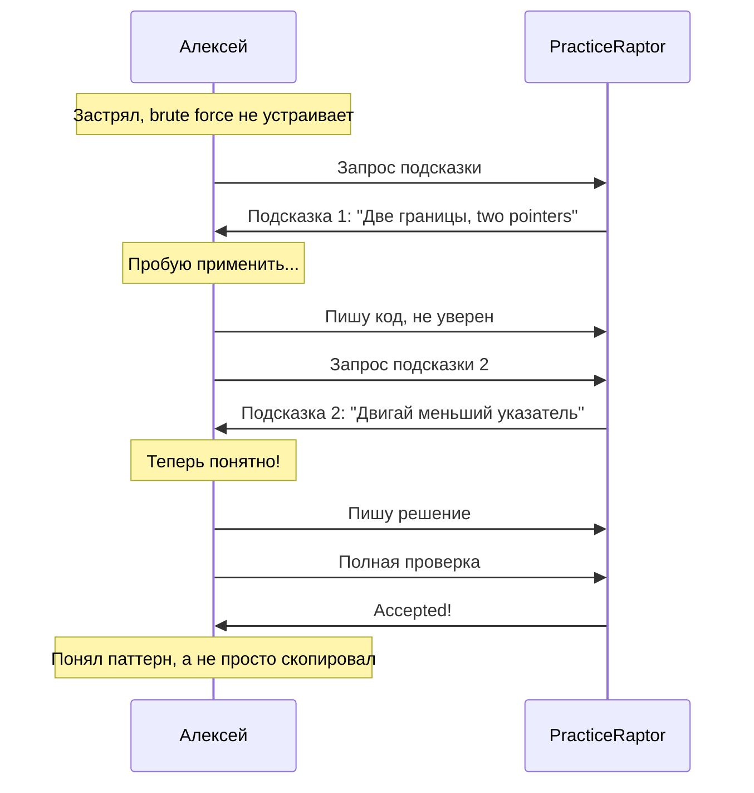

# Сценарий 2: Использование подсказки

## 1. Контекст и мотивация

### Ситуация

Алексей выбрал задачу средней сложности «Container With Most Water». Он понимает условие, но не может придумать эффективное решение. Brute force O(n²) работает, но он знает, что это неоптимально. Прошло 15 минут, и он начинает терять уверенность.

### Внутренний монолог

> «Два вложенных цикла — это точно не то, что от меня ждут на собеседовании. Должен быть способ за O(n). Two pointers? Но как именно? Может, подсказка поможет — не хочу сразу смотреть решение, хочу додуматься сам.»

### Эмоциональное состояние

- **В начале:** Фрустрация, застревание
- **Ожидание:** Направление, а не готовый ответ
- **Страх:** Что подсказка сразу раскроет всё решение

---

## 2. Задача пользователя (Job to be Done)

**Когда** я застрял на задаче и не знаю, как подступиться,
**я хочу** получить направляющую подсказку,
**чтобы** продвинуться самостоятельно, не читая готовое решение.

### Подзадачи

1. Осознать, что нужна помощь
2. Найти и активировать подсказку
3. Получить подсказку, которая не спойлерит решение
4. Применить подсказку к своему коду
5. Продолжить решение с новым пониманием

---

## 3. Предусловия

| Условие | Статус |
|---------|--------|
| Задача открыта | ✓ |
| Пользователь в режиме решения или деталей | ✓ |
| Есть написанный код (draft) | ✓ |
| Пользователь застрял | ✓ |

---

## 4. Пошаговые действия

### Шаг 1: Осознание тупика

**Действие:** Алексей несколько раз переписывает код, но не находит эффективного решения.

**Мысли:** «Уже 15 минут. Brute force работает, но это O(n²). Должен быть паттерн, который я не вижу.»

**Поведение:**
- Пробует разные подходы
- Смотрит на примеры ещё раз
- Рисует на бумаге (если не в транспорте)

**Результат:** Принимает решение воспользоваться подсказкой.

---

### Шаг 2: Запрос подсказки

**Действие:** Алексей активирует подсказку.

**Мысли:** «Надеюсь, это не будет сразу готовый алгоритм. Хочу понять идею.»

**Система предоставляет:** Доступ к подсказкам (возможно, несколько уровней).

**Результат:** Открывается первая подсказка.

---

### Шаг 3: Получение подсказки (уровень 1)

**Действие:** Алексей читает первую подсказку.

**Система показывает:**
```
💡 Подсказка 1/3:

Подумай о задаче с точки зрения двух границ контейнера.
Что определяет объём воды? Как можно двигать эти границы?
```

**Мысли:** «Две границы... ширина и высота. Если двигать с краёв... Two pointers!»

**Результат:** Алексей получает направление, но не готовое решение.

---

### Шаг 4: Попытка применить подсказку

**Действие:** Алексей возвращается к коду и пробует реализовать идею.

**Мысли:** «Два указателя с начала и конца. Но какой двигать? Тот, который меньше! Потому что...»

**Поведение:**
- Переключается между подсказкой и редактором
- Экспериментирует с кодом
- Возможно, нужна ещё одна подсказка

**Результат:** Частичное понимание, нужно уточнение.

---

### Шаг 5: Запрос дополнительной подсказки (опционально)

**Действие:** Алексей запрашивает следующую подсказку.

**Система показывает:**
```
💡 Подсказка 2/3:

При использовании two pointers, всегда двигай указатель,
который указывает на меньшую высоту. Почему? Потому что
перемещение большего не может увеличить объём — ограничивает
меньший.

[Показать следующую подсказку?]
```

**Мысли:** «Ага! Меньший ограничивает, поэтому его и двигаем. Теперь понятно!»

**Результат:** Алексей понимает логику и готов реализовать.

---

### Шаг 6: Реализация с новым пониманием

**Действие:** Алексей переписывает решение с two pointers.

**Код:**
```python
def max_area(height: list[int]) -> int:
    left, right = 0, len(height) - 1
    max_water = 0

    while left < right:
        width = right - left
        h = min(height[left], height[right])
        max_water = max(max_water, width * h)

        if height[left] < height[right]:
            left += 1
        else:
            right -= 1

    return max_water
```

**Результат:** Код написан, готов к проверке.

---

### Шаг 7: Проверка и успех

**Действие:** Алексей отправляет решение.

**Система показывает:** Accepted!

**Мысли:** «Получилось! И я понял, почему это работает, а не просто скопировал.»

**Эмоциональное состояние:** Удовлетворение от обучения, а не от «читерства».

---

## 5. Диаграмма сценария



---

## 6. Примеры интерфейсов

### CLI (REPL)

```bash
> solve
[Opening editor...]

[Editor closed. Code saved.]

> check
Running examples...
  Example 1: ✓ Passed (but O(n²) detected)

> hint

💡 Подсказка 1/3:

Подумай о задаче с точки зрения двух границ контейнера.
Что определяет объём воды? Как можно двигать эти границы?

[Показать следующую? y/n] y

💡 Подсказка 2/3:

При использовании two pointers, всегда двигай указатель,
который указывает на меньшую высоту. Перемещение большего
не может увеличить объём.

[Показать следующую? y/n] n

> solve
[Opening editor with saved draft...]

[Editor closed. Code saved.]

> submit
Running full test suite...
  Test 1/20: ✓
  ...
  Test 20/20: ✓

╔═══════════════════════════════════════════════════════════╗
║  ✓ Accepted!                                              ║
╠═══════════════════════════════════════════════════════════╣
║  Runtime: 156ms (beats 85%)                               ║
║  Memory:  17.1 MB                                         ║
╚═══════════════════════════════════════════════════════════╝
```

### Telegram Bot

```
✏️ Режим решения: Container With Most Water

[💡 Подсказка] [❌ Отмена]
```

*Пользователь нажимает «Подсказка»*

```
💡 Подсказка 1/3:

Подумай о задаче с точки зрения двух границ контейнера.
Что определяет объём воды? Как можно двигать эти границы?

[➡️ Следующая подсказка] [✏️ Продолжить решение]
```

*Пользователь нажимает «Следующая»*

```
💡 Подсказка 2/3:

При использовании two pointers, всегда двигай указатель,
который указывает на меньшую высоту.

[➡️ Следующая подсказка] [✏️ Продолжить решение]
```

*Пользователь нажимает «Продолжить решение»*

```
✏️ Режим решения: Container With Most Water

Отправьте обновлённый код решения.

[💡 Подсказка] [❌ Отмена]
```

---

## 7. Дизайн системы подсказок

### Принципы

| Принцип | Описание |
|---------|----------|
| Прогрессивное раскрытие | От общего к конкретному |
| Не спойлерить | Направление, а не код |
| Обучение | Объяснять «почему», а не только «что» |
| Контроль | Пользователь решает, когда смотреть следующую |

### Структура подсказок (3 уровня)

| Уровень | Содержание | Пример |
|---------|------------|--------|
| 1 | Общая идея, паттерн | «Подумай о two pointers» |
| 2 | Конкретное направление | «Двигай меньший указатель» |
| 3 | Почти решение | Псевдокод или ключевой инсайт |

---

## 8. Возможные проблемы и решения

| Проблема | Причина | Решение |
|----------|---------|---------|
| Подсказка слишком абстрактная | Непонятно, как применить | Добавить пример или визуализацию |
| Подсказка сразу раскрывает решение | Плохо написана | Уровневая система, ревью подсказок |
| Пользователь не хочет «читерить» | Стигма подсказок | Позиционировать как обучение |
| Код сбросился после подсказки | Баг | Сохранять draft при просмотре подсказки |

---

## 9. Критерии успеха

| Метрика | Целевое значение |
|---------|------------------|
| Процент решений после подсказки | > 70% |
| Среднее количество подсказок до решения | 1-2 |
| Удовлетворённость подсказкой | > 4/5 |
| Ощущение обучения (а не читерства) | Да |

---

## 10. Связанные сценарии

- [Сценарий 1: Первое решение задачи](./01_first_problem_solution.md) — базовый flow
- [Editorial](../information_architecture/sitemap.md) — когда нужен полный разбор
