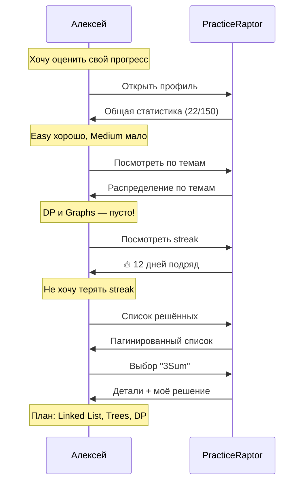

# Сценарий 3: Просмотр прогресса

## 1. Контекст и мотивация

### Ситуация

Алексей практикуется на PracticeRaptor уже две недели. Он решил около 20 задач и хочет понять, насколько продвинулся. Через месяц у него собеседование, и он хочет оценить свою готовность и понять, на чём сосредоточиться.

### Внутренний монолог

> «Сколько я уже решил? Вроде неплохо, но в основном Easy. Надо посмотреть статистику — может, пора браться за Medium посерьёзнее. И интересно, какие темы я прокачал, а какие провисают.»

### Эмоциональное состояние

- **В начале:** Любопытство, желание оценить себя
- **Ожидание:** Чёткая картина прогресса, направление для развития
- **Риск:** Если статистика разочарует — потеря мотивации

---

## 2. Задача пользователя (Job to be Done)

**Когда** я занимаюсь подготовкой к собеседованию,
**я хочу** видеть свой прогресс и слабые места,
**чтобы** эффективно распределять время на оставшиеся темы.

### Подзадачи

1. Увидеть общий прогресс (решено X из Y)
2. Понять распределение по сложности
3. Определить сильные и слабые темы
4. Увидеть streak (мотивация)
5. Найти конкретные решённые задачи (вспомнить подход)

---

## 3. Предусловия

| Условие | Статус |
|---------|--------|
| Есть решённые задачи | ✓ (20 задач) |
| Пользователь авторизован / имеет локальную историю | ✓ |
| Статистика собирается системой | ✓ |

---

## 4. Пошаговые действия

### Шаг 1: Переход в профиль

**Действие:** Алексей открывает раздел профиля.

**Мысли:** «Посмотрю, как у меня дела.»

**Система показывает:** Обзорный экран профиля с ключевыми метриками.

**Результат:** Алексей видит общую картину.

---

### Шаг 2: Просмотр общего прогресса

**Действие:** Алексей смотрит на основные показатели.

**Система показывает:**
```
Прогресс: 22 / 150 задач (15%)

Easy:   15/50  ██████░░░░ 30%
Medium:  6/70  ██░░░░░░░░  9%
Hard:    1/30  █░░░░░░░░░  3%
```

**Мысли:** «Ага, 22 задачи. Easy хорошо, но Medium явно мало. Hard почти не трогал.»

**Результат:** Понимание общей ситуации.

---

### Шаг 3: Анализ по темам

**Действие:** Алексей смотрит распределение по темам.

**Система показывает:**
```
Темы:
  Arrays:        8/20  ████████░░ 40%
  Strings:       5/15  █████░░░░░ 33%
  Hash Table:    4/12  ████░░░░░░ 33%
  Two Pointers:  3/10  ███░░░░░░░ 30%
  Linked List:   1/12  █░░░░░░░░░  8%
  Trees:         1/18  █░░░░░░░░░  6%
  DP:            0/25  ░░░░░░░░░░  0%
  Graphs:        0/15  ░░░░░░░░░░  0%
```

**Мысли:** «Linked List и Trees — слабо. DP и Graphs вообще ноль. Надо подтянуть.»

**Результат:** Выявлены слабые места.

---

### Шаг 4: Просмотр streak

**Действие:** Алексей обращает внимание на streak.

**Система показывает:**
```
🔥 Streak: 12 дней подряд!
   Лучший streak: 12 дней (текущий)
```

**Мысли:** «Неплохо, две недели без пропусков. Не хочу терять.»

**Эмоциональный эффект:** Мотивация продолжать.

**Результат:** Дополнительный стимул.

---

### Шаг 5: Просмотр решённых задач

**Действие:** Алексей хочет посмотреть список решённых задач.

**Мысли:** «Какие именно Medium я решил? Хочу вспомнить подходы.»

**Система показывает:**
```
Решённые задачи (страница 1/3):

#   Задача                  Сложность  Время   Дата
────────────────────────────────────────────────────
1.  Two Sum                 Easy       52ms    12 дек
2.  Valid Parentheses       Easy       34ms    12 дек
3.  Container With Water    Medium     156ms   13 дек
4.  3Sum                    Medium     312ms   14 дек
...

[< Назад] [1] [2] [3] [Вперёд >]
```

**Результат:** Алексей может найти конкретную задачу.

---

### Шаг 6: Переход к конкретной задаче

**Действие:** Алексей выбирает задачу из списка.

**Мысли:** «3Sum — как я её решил? Хочу вспомнить.»

**Система показывает:** Детали задачи (с возможностью посмотреть своё решение).

**Результат:** Алексей может пересмотреть свой код и подход.

---

### Шаг 7: Принятие решения о следующих шагах

**Действие:** Алексей анализирует данные и планирует.

**Мысли:** «План на неделю: 3 задачи на Linked List, 3 на Trees, начать DP. Medium — минимум 5 штук.»

**Результат:** Чёткий план развития.

---

## 5. Диаграмма сценария



---

## 6. Примеры интерфейсов

### CLI (REPL)

```bash
> profile

╔═══════════════════════════════════════════════════════════╗
║  👤 Профиль                                               ║
╠═══════════════════════════════════════════════════════════╣
║                                                           ║
║  📊 Прогресс: 22 / 150 задач                              ║
║                                                           ║
║  Easy:   15/50  ██████░░░░ 30%                            ║
║  Medium:  6/70  ██░░░░░░░░  9%                            ║
║  Hard:    1/30  █░░░░░░░░░  3%                            ║
║                                                           ║
║  🔥 Streak: 12 дней (лучший: 12)                          ║
║                                                           ║
╚═══════════════════════════════════════════════════════════╝

Commands: [stats] [solved] [history] [back]

> stats

📊 Статистика по темам:

Тема             Решено    Прогресс
─────────────────────────────────────
Arrays           8/20      ████████░░ 40%
Strings          5/15      █████░░░░░ 33%
Hash Table       4/12      ████░░░░░░ 33%
Two Pointers     3/10      ███░░░░░░░ 30%
Linked List      1/12      █░░░░░░░░░  8%
Trees            1/18      █░░░░░░░░░  6%
DP               0/25      ░░░░░░░░░░  0%
Graphs           0/15      ░░░░░░░░░░  0%

💡 Рекомендация: Попробуй задачи на Linked List и Trees

> solved

Решённые задачи (страница 1/3):

#   Задача                  Сложность  Дата
───────────────────────────────────────────
1.  Two Sum                 Easy       12 дек
2.  Valid Parentheses       Easy       12 дек
3.  Container With Water    Medium     13 дек
4.  3Sum                    Medium     14 дек
5.  Merge Two Sorted Lists  Easy       14 дек
...

[n: next page] [p: prev page] [q: back]

> show 3sum
[Показывает детали задачи с возможностью посмотреть своё решение]
```

### Telegram Bot

```
🤖 PracticeRaptor

[📚 Задачи] [👤 Профиль] [⚙️ Настройки]
```

*Пользователь нажимает «Профиль»*

```
👤 Твой профиль

📊 Прогресс: 22/150 задач (15%)

Easy:   ██████░░░░ 15/50
Medium: ██░░░░░░░░ 6/70
Hard:   █░░░░░░░░░ 1/30

🔥 Streak: 12 дней подряд!

[📈 Подробная статистика]
[✅ Решённые задачи]
[◀️ Назад]
```

*Пользователь нажимает «Подробная статистика»*

```
📈 Статистика по темам

✅ Сильные:
  • Arrays: 40%
  • Strings: 33%

⚠️ Нужно подтянуть:
  • Linked List: 8%
  • Trees: 6%

❌ Не начаты:
  • DP: 0%
  • Graphs: 0%

[◀️ Назад к профилю]
```

### Web

```
┌─────────────────────────────────────────────────────────────┐
│  🦖 PracticeRaptor          [Problems] [Profile] [Settings] │
├─────────────────────────────────────────────────────────────┤
│                                                             │
│  Profile                                    🔥 12 day streak │
│  ─────────────────────────────────────────────────────────  │
│                                                             │
│  ┌─────────────────┐  ┌─────────────────────────────────┐   │
│  │ Progress        │  │ Topics                          │   │
│  │                 │  │                                 │   │
│  │  22/150 (15%)   │  │ Arrays      ████████░░ 40%     │   │
│  │                 │  │ Strings     █████░░░░░ 33%     │   │
│  │ Easy   ██████░░ │  │ Hash Table  ████░░░░░░ 33%     │   │
│  │ Medium ██░░░░░░ │  │ Linked List █░░░░░░░░░  8%     │   │
│  │ Hard   █░░░░░░░ │  │ Trees       █░░░░░░░░░  6%     │   │
│  │                 │  │ DP          ░░░░░░░░░░  0%     │   │
│  └─────────────────┘  └─────────────────────────────────┘   │
│                                                             │
│  Solved Problems                                            │
│  ┌─────────────────────────────────────────────────────┐    │
│  │ Two Sum              Easy       52ms    Dec 12      │    │
│  │ Valid Parentheses    Easy       34ms    Dec 12      │    │
│  │ Container With...    Medium    156ms    Dec 13      │    │
│  └─────────────────────────────────────────────────────┘    │
│  [Show all →]                                               │
│                                                             │
└─────────────────────────────────────────────────────────────┘
```

---

## 7. Элементы геймификации

### Streak

| Элемент | Назначение |
|---------|------------|
| Текущий streak | Мотивация не пропускать |
| Лучший streak | Цель для побития |
| Визуальный индикатор (🔥) | Эмоциональный отклик |

### Прогресс-бары

| Элемент | Назначение |
|---------|------------|
| Общий прогресс | Ощущение продвижения |
| По сложности | Понимание распределения усилий |
| По темам | Выявление пробелов |

### Рекомендации

| Элемент | Назначение |
|---------|------------|
| «Попробуй тему X» | Направление развития |
| «N задач до следующего уровня» | Микро-цели |

---

## 8. Возможные проблемы и решения

| Проблема | Причина | Решение |
|----------|---------|---------|
| Статистика демотивирует | Много нерешённого | Фокус на достижениях, не на пробелах |
| Непонятно, что делать дальше | Нет рекомендаций | Добавить умные рекомендации |
| Не находит конкретную задачу | Плохой поиск/фильтрация | Поиск в списке решённых |
| Streak потерян — разочарование | Один пропущенный день | «Freeze» функция (premium?) |

---

## 9. Критерии успеха

| Метрика | Целевое значение |
|---------|------------------|
| Время на просмотр статистики | < 2 минуты |
| Понимание своих слабых мест | Да |
| Мотивация после просмотра | Повышается |
| Переход к решению задачи после просмотра | > 50% сессий |

---

## 10. Связанные сценарии

- [Сценарий 1: Первое решение задачи](./01_first_problem_solution.md) — увеличивает статистику
- [Сценарий 4: Изменение настроек](./04_changing_settings.md) — настройка фильтров по умолчанию
- [Сценарий 5: Случайная задача](./05_random_problem.md) — быстрый выбор для streak
