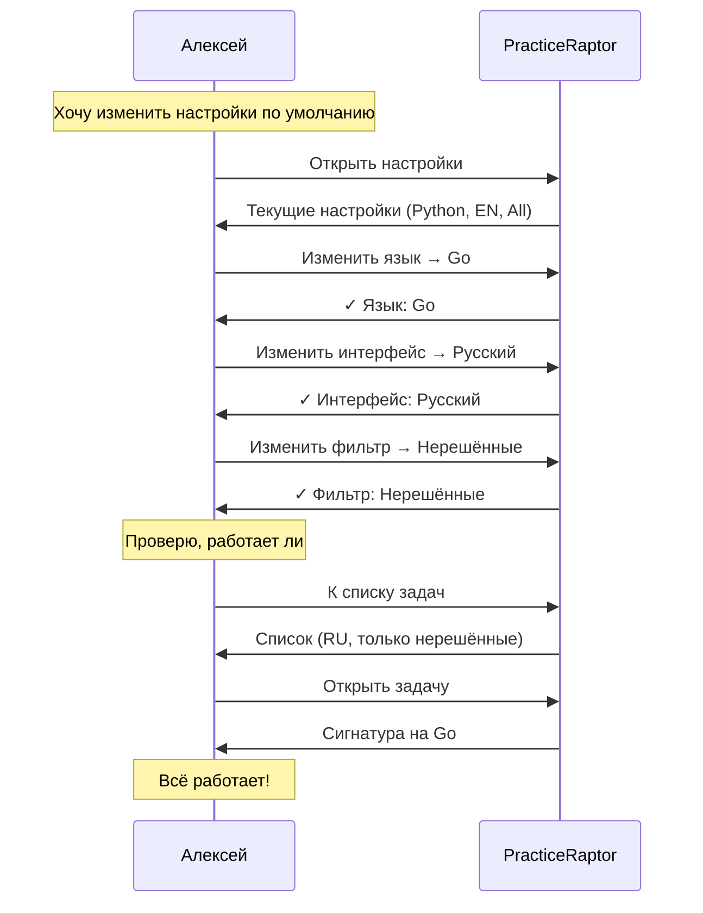

# Сценарий 4: Изменение настроек

## 1. Контекст и мотивация

### Ситуация

Алексей решил, что хочет практиковаться на Go вместо Python — на его будущей работе используют Go, и он хочет убить двух зайцев: и алгоритмы подтянуть, и язык освоить. Также он хочет, чтобы интерфейс был на русском и по умолчанию показывались только нерешённые задачи.

### Внутренний монолог

> «Каждый раз выбирать Go в редакторе — неудобно. Должна быть настройка по умолчанию. И фильтр 'нерешённые' тоже хочу сохранить — зачем мне видеть то, что уже сделал?»

### Эмоциональное состояние

- **В начале:** Лёгкое раздражение от повторяющихся действий
- **Ожидание:** Быстрая настройка, которая запомнится
- **Риск:** Если настройки сложно найти — будет терпеть неудобства

---

## 2. Задача пользователя (Job to be Done)

**Когда** я постоянно выполняю одни и те же действия при старте,
**я хочу** настроить значения по умолчанию,
**чтобы** сразу работать в нужной конфигурации без лишних кликов.

### Подзадачи

1. Найти раздел настроек
2. Изменить язык программирования по умолчанию
3. Изменить язык интерфейса (i18n)
4. Настроить фильтры по умолчанию
5. Убедиться, что настройки сохранились

---

## 3. Предусловия

| Условие | Статус |
|---------|--------|
| Пользователь авторизован / имеет локальный конфиг | ✓ |
| Настройки доступны из любого экрана | ✓ |
| Go поддерживается платформой | ✓ |

---

## 4. Пошаговые действия

### Шаг 1: Переход в настройки

**Действие:** Алексей открывает раздел настроек.

**Мысли:** «Где тут настройки? Должно быть в профиле или отдельно.»

**Система предоставляет:** Очевидный доступ к настройкам (глобальная навигация).

**Результат:** Открывается экран настроек.

---

### Шаг 2: Просмотр текущих настроек

**Действие:** Алексей видит текущую конфигурацию.

**Система показывает:**
```
Настройки:

Язык программирования: Python
Язык интерфейса:       English
Фильтр по умолчанию:   Все задачи
```

**Мысли:** «Ага, Python и English. Надо поменять.»

**Результат:** Понимание текущего состояния.

---

### Шаг 3: Изменение языка программирования

**Действие:** Алексей меняет язык программирования на Go.

**Система предоставляет:**
- Список доступных языков (Python, Go, JavaScript, Java)
- Выбор через селектор/команду

**Результат:** Язык изменён на Go.

---

### Шаг 4: Изменение языка интерфейса

**Действие:** Алексей меняет язык интерфейса на русский.

**Система предоставляет:**
- Список доступных языков (English, Русский)
- Мгновенное применение

**Результат:** Интерфейс переключается на русский.

---

### Шаг 5: Настройка фильтров по умолчанию

**Действие:** Алексей устанавливает фильтр «только нерешённые».

**Система предоставляет:**
- Опции: Все / Решённые / Нерешённые
- Возможно, дополнительные фильтры (сложность, темы)

**Результат:** Фильтр по умолчанию изменён.

---

### Шаг 6: Подтверждение сохранения

**Действие:** Алексей проверяет, что настройки сохранены.

**Система показывает:**
```
✓ Настройки сохранены

Язык программирования: Go
Язык интерфейса:       Русский
Фильтр по умолчанию:   Нерешённые
```

**Мысли:** «Отлично, всё запомнилось.»

**Результат:** Уверенность, что настройки применены.

---

### Шаг 7: Проверка в действии

**Действие:** Алексей возвращается к списку задач.

**Система показывает:**
- Интерфейс на русском
- Только нерешённые задачи
- При открытии задачи — сигнатура на Go

**Мысли:** «Работает! Теперь не надо каждый раз настраивать.»

**Результат:** Настройки применены корректно.

---

## 5. Диаграмма сценария



---

## 6. Примеры интерфейсов

### CLI (REPL)

```bash
> config

╔═══════════════════════════════════════════════════════════╗
║  ⚙️  Настройки                                            ║
╠═══════════════════════════════════════════════════════════╣
║                                                           ║
║  language:  python     [python, go, javascript, java]     ║
║  locale:    en         [en, ru]                           ║
║  filter:    all        [all, solved, unsolved]            ║
║                                                           ║
╚═══════════════════════════════════════════════════════════╝

Usage: config <key> <value>

> config language go
✓ language set to: go

> config locale ru
✓ locale изменён на: ru

> config filter unsolved
✓ фильтр изменён на: unsolved

> config

╔═══════════════════════════════════════════════════════════╗
║  ⚙️  Настройки                                            ║
╠═══════════════════════════════════════════════════════════╣
║                                                           ║
║  language:  go         [python, go, javascript, java]     ║
║  locale:    ru         [en, ru]                           ║
║  filter:    unsolved   [all, solved, unsolved]            ║
║                                                           ║
╚═══════════════════════════════════════════════════════════╝

> list
Найдено 128 нерешённых задач.

  #   Задача                  Сложность  Теги
  ─────────────────────────────────────────────
  1.  Merge Intervals         Medium     array, sorting
  2.  LRU Cache               Medium     hash-table, design
  ...

> show merge-intervals

func mergeIntervals(intervals [][]int) [][]int {
    // Ваш код здесь
}
```

### Telegram Bot

```
🤖 PracticeRaptor

[📚 Задачи] [👤 Профиль] [⚙️ Настройки]
```

*Пользователь нажимает «Настройки»*

```
⚙️ Настройки

Язык программирования: Python
Язык интерфейса: English
Фильтр по умолчанию: Все

Что изменить?

[🖥 Язык кода] [🌐 Язык UI] [🔍 Фильтр]
[◀️ Назад]
```

*Пользователь нажимает «Язык кода»*

```
🖥 Выберите язык программирования:

[Python ✓] [Go] [JavaScript] [Java]
```

*Пользователь нажимает «Go»*

```
✅ Язык программирования изменён на Go

[◀️ К настройкам]
```

*После всех изменений:*

```
⚙️ Настройки

Язык программирования: Go ✓
Язык интерфейса: Русский ✓
Фильтр по умолчанию: Нерешённые ✓

[🖥 Язык кода] [🌐 Язык UI] [🔍 Фильтр]
[◀️ Назад]
```

### Web

```
┌─────────────────────────────────────────────────────────────┐
│  🦖 PracticeRaptor          [Задачи] [Профиль] [Настройки]  │
├─────────────────────────────────────────────────────────────┤
│                                                             │
│  Настройки                                                  │
│  ─────────────────────────────────────────────────────────  │
│                                                             │
│  Язык программирования                                      │
│  ┌─────────────────────────────────────────────────────┐    │
│  │  ○ Python   ● Go   ○ JavaScript   ○ Java            │    │
│  └─────────────────────────────────────────────────────┘    │
│                                                             │
│  Язык интерфейса                                            │
│  ┌─────────────────────────────────────────────────────┐    │
│  │  ○ English   ● Русский                               │    │
│  └─────────────────────────────────────────────────────┘    │
│                                                             │
│  Фильтр по умолчанию                                        │
│  ┌─────────────────────────────────────────────────────┐    │
│  │  ○ Все   ○ Решённые   ● Нерешённые                   │    │
│  └─────────────────────────────────────────────────────┘    │
│                                                             │
│  [Сохранить]                              Изменения сохранены│
│                                                             │
└─────────────────────────────────────────────────────────────┘
```

---

## 7. Хранение настроек

### По интерфейсам

| Интерфейс | Хранение | Файл/Место |
|-----------|----------|------------|
| CLI | Локальный файл | `~/.config/practiceraptor/config.yaml` |
| Telegram | Серверная БД | Привязка к Telegram ID |
| Web | Серверная БД + localStorage | Синхронизация |

### Формат конфига (CLI)

```yaml
# ~/.config/practiceraptor/config.yaml
language: go
locale: ru
default_filter: unsolved
editor: vim  # для CLI
```

---

## 8. Доступные настройки

| Настройка | Опции | По умолчанию |
|-----------|-------|--------------|
| `language` | python, go, javascript, java | python |
| `locale` | en, ru | en |
| `default_filter` | all, solved, unsolved | all |
| `editor` (CLI only) | vim, nano, code, emacs | vim |

---

## 9. Возможные проблемы и решения

| Проблема | Причина | Решение |
|----------|---------|---------|
| Настройки не найдены | Неочевидный путь | Глобальная навигация, help |
| Язык не поддерживается | Ещё не реализован | Показать «Coming soon» |
| Настройки сбросились | Баг или переустановка | Синхронизация с сервером |
| Непонятно, что изменилось | Нет подтверждения | Визуальное подтверждение |

---

## 10. Критерии успеха

| Метрика | Целевое значение |
|---------|------------------|
| Время на изменение настройки | < 30 секунд |
| Находимость раздела настроек | < 2 клика/команды |
| Настройки применяются сразу | Да |
| Настройки сохраняются между сессиями | Да |

---

## 11. Связанные сценарии

- [Сценарий 1: Первое решение задачи](./01_first_problem_solution.md) — использует настройки
- [Сценарий 3: Просмотр прогресса](./03_viewing_progress.md) — ссылка из профиля
