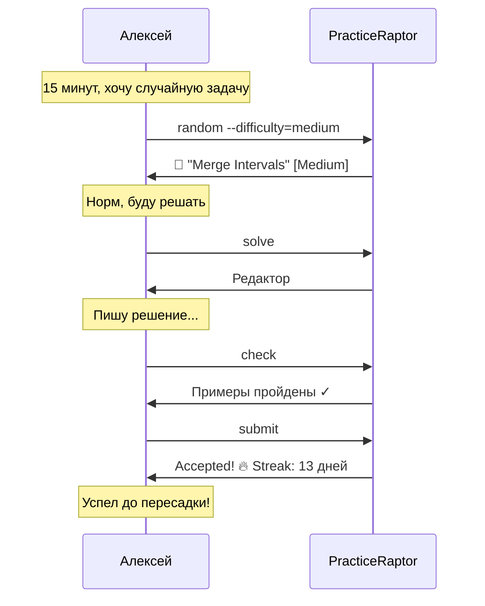

# Сценарий 5: Случайная задача

## 1. Контекст и мотивация

### Ситуация

Алексей едет в метро, у него 15 минут до пересадки. Он хочет решить одну задачу, чтобы не терять streak, но не хочет тратить время на выбор — пусть система предложит что-то подходящее. Он открывает Telegram-бот (или CLI на ноутбуке) и использует функцию случайного выбора.

### Внутренний монолог

> «Не хочу залипать в списке, выбирая идеальную задачу. Пусть будет случайная — главное, чтобы подходила по сложности. Medium, нерешённая, любая тема. Погнали!»

### Эмоциональное состояние

- **В начале:** Решительность, ограниченность во времени
- **Ожидание:** Мгновенный выбор без анализа
- **Риск:** Если задача слишком сложная или неинтересная

---

## 2. Задача пользователя (Job to be Done)

**Когда** у меня мало времени и я не хочу выбирать,
**я хочу** получить случайную задачу по моим критериям,
**чтобы** сразу начать решать и не тратить время на поиск.

### Подзадачи

1. Задать критерии (сложность, статус)
2. Получить случайную задачу
3. Оценить, подходит ли
4. Начать решать или запросить другую

---

## 3. Предусловия

| Условие | Статус |
|---------|--------|
| Есть нерешённые задачи | ✓ |
| Фильтры работают | ✓ |
| Пользователь знает о функции random | ✓ |

---

## 4. Пошаговые действия

### Шаг 1: Запрос случайной задачи

**Действие:** Алексей запрашивает случайную задачу с фильтрами.

**Мысли:** «Medium, нерешённая — давай!»

**Система принимает:**
- Фильтр по сложности (опционально)
- Фильтр по статусу (опционально)
- Фильтр по теме (опционально)

**Результат:** Система выбирает случайную задачу.

---

### Шаг 2: Получение задачи

**Действие:** Система показывает выбранную задачу.

**Система показывает:**
```
🎲 Случайная задача:

"Merge Intervals" [Medium]
Теги: array, sorting

Объедините все пересекающиеся интервалы...
```

**Мысли:** «О, Merge Intervals! Слышал про неё. Норм, буду решать.»

**Результат:** Алексей видит задачу и принимает решение.

---

### Шаг 3: Принятие или отклонение

**Сценарий A — задача подходит:**

**Действие:** Алексей начинает решать.

**Мысли:** «Интересная задача, попробую.»

**Результат:** Переход к решению.

---

**Сценарий B — задача не подходит:**

**Действие:** Алексей запрашивает другую случайную задачу.

**Мысли:** «Graphs сейчас не хочу, дай другую.»

**Система показывает:** Новую случайную задачу.

**Результат:** Повторный выбор (до 2-3 раз, потом просто выбрать из списка).

---

### Шаг 4: Решение задачи

**Действие:** Алексей решает задачу в ограниченное время.

**Мысли:** «10 минут до пересадки, успею написать brute force и проверить.»

**Поведение:**
- Быстро пишет решение
- Проверяет на примерах
- Отправляет на полную проверку

**Результат:** Accepted (или нет, но попытка засчитана).

---

### Шаг 5: Сохранение streak

**Действие:** Задача решена, streak продолжается.

**Система показывает:**
```
✓ Accepted!
🔥 Streak: 13 дней!
```

**Мысли:** «Успел! Streak сохранён.»

**Эмоциональное состояние:** Удовлетворение, чувство продуктивности.

---

## 5. Диаграмма сценария



---

## 6. Примеры интерфейсов

### CLI (REPL)

```bash
> random
🎲 Случайная задача:

╔═══════════════════════════════════════════════════════════╗
║  Merge Intervals                                [Medium]  ║
╠═══════════════════════════════════════════════════════════╣
║  Теги: array, sorting                                     ║
╚═══════════════════════════════════════════════════════════╝

Given an array of intervals, merge all overlapping intervals.

Example:
  Input: [[1,3],[2,6],[8,10],[15,18]]
  Output: [[1,6],[8,10],[15,18]]

Commands: [solve] [another] [back]

> solve
[Opening editor...]
```

**С фильтрами:**

```bash
> random --difficulty=medium --status=unsolved

🎲 Случайная задача (Medium, нерешённые):

"3Sum Closest" [Medium]
Теги: array, two-pointers

> random --topic=trees

🎲 Случайная задача (Trees):

"Validate BST" [Medium]
Теги: trees, dfs
```

### Telegram Bot

```
🤖 PracticeRaptor

[📚 Задачи] [👤 Профиль] [⚙️ Настройки]
```

*Пользователь нажимает «Задачи»*

```
📚 Выберите сложность:

[Easy] [Medium] [Hard] [Все]
[🎲 Случайная]
```

*Пользователь нажимает «Случайная»*

```
🎲 Случайная задача?

Выбери параметры или получи полностью случайную:

[🟢 Easy] [🟡 Medium] [🔴 Hard]
[🎲 Любая сложность]
```

*Пользователь нажимает «Medium»*

```
🎲 Merge Intervals [Medium]
Теги: array, sorting

Given an array of intervals, merge all overlapping intervals.

Example:
  Input: [[1,3],[2,6],[8,10],[15,18]]
  Output: [[1,6],[8,10],[15,18]]

[▶️ Решать] [🎲 Другая] [◀️ Назад]
```

*Пользователь нажимает «Решать»*

```
✏️ Режим решения: Merge Intervals

Отправьте код решения.

[❌ Отмена]
```

### Web

```
┌─────────────────────────────────────────────────────────────┐
│  🦖 PracticeRaptor          [Problems] [Profile] [Settings] │
├─────────────────────────────────────────────────────────────┤
│                                                             │
│  Problems                              [🎲 Random Problem]  │
│  ─────────────────────────────────────────────────────────  │
│                                                             │
│  Filters: [Medium ▼] [All Topics ▼] [Unsolved ▼]            │
│                                                             │
│  ...                                                        │
└─────────────────────────────────────────────────────────────┘
```

*Пользователь нажимает «Random Problem»*

```
┌─────────────────────────────────────────────────────────────┐
│                                                             │
│  🎲 Random Problem                                          │
│  ─────────────────────────────────────────────────────────  │
│                                                             │
│  ┌─────────────────────────────────────────────────────┐    │
│  │                                                     │    │
│  │  Merge Intervals                          [Medium]  │    │
│  │  Tags: array, sorting                               │    │
│  │                                                     │    │
│  │  Given an array of intervals, merge all             │    │
│  │  overlapping intervals...                           │    │
│  │                                                     │    │
│  │  [Solve This]  [🎲 Pick Another]                    │    │
│  │                                                     │    │
│  └─────────────────────────────────────────────────────┘    │
│                                                             │
└─────────────────────────────────────────────────────────────┘
```

---

## 7. Алгоритм выбора случайной задачи

### Логика

```
1. Применить фильтры пользователя (сложность, тема, статус)
2. Получить список подходящих задач
3. Если список пуст:
   - Сообщить пользователю
   - Предложить изменить фильтры
4. Иначе:
   - Выбрать случайную задачу из списка
   - Показать пользователю
```

### Учёт истории (опционально)

| Фактор | Влияние |
|--------|---------|
| Недавно просмотренные | Понижение приоритета |
| Давно не решалась тема | Повышение приоритета |
| Частые отказы от задачи | Убрать из random на время |

---

## 8. Параметры команды random

| Параметр | Описание | Пример |
|----------|----------|--------|
| `--difficulty` | Фильтр по сложности | `--difficulty=medium` |
| `--topic` | Фильтр по теме | `--topic=trees` |
| `--status` | Фильтр по статусу | `--status=unsolved` |
| (без параметров) | Использовать настройки по умолчанию | `random` |

---

## 9. Возможные проблемы и решения

| Проблема | Причина | Решение |
|----------|---------|---------|
| Нет подходящих задач | Все решены или фильтры слишком узкие | Сообщить, предложить изменить фильтры |
| Одна и та же задача | Мало задач в выборке | Исключать недавно показанные |
| Задача слишком сложная | Не учитывается уровень пользователя | Умный подбор по истории |
| Не хочу эту тему | Личные предпочтения | Опция «Другая» |

---

## 10. Критерии успеха

| Метрика | Целевое значение |
|---------|------------------|
| Время от команды до начала решения | < 30 секунд |
| Процент принятия первой задачи | > 70% |
| Использование random vs список | > 20% сессий |
| Удовлетворённость выбором | > 4/5 |

---

## 11. Use Cases для Random

| Сценарий | Почему random |
|----------|---------------|
| Мало времени | Не хочу выбирать |
| Streak на исходе | Быстро решить что-нибудь |
| Не знаю, что решать | Пусть система решит |
| Хочу разнообразия | Выйти из зоны комфорта |
| Практика перед собеседованием | Симуляция неизвестной задачи |

---

## 12. Связанные сценарии

- [Сценарий 1: Первое решение задачи](./01_first_problem_solution.md) — базовый flow решения
- [Сценарий 3: Просмотр прогресса](./03_viewing_progress.md) — streak мотивация
- [Сценарий 4: Изменение настроек](./04_changing_settings.md) — настройка фильтров по умолчанию
